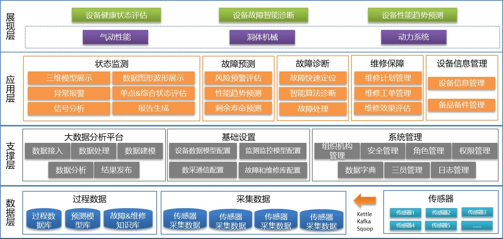

# 风洞设备健康管理系统

## 系统架构

## 问题与挑战

1、设备安装的传感器种类和数量多，数据采集系统采样频率高，长期累积数据量大 

2、故障复杂，包括振动、劣化等过程

3、涉及风洞流场品质的气动特性分析

4、涉及风洞洞体机械的结构状态分析，包括故障问题中的应力、应变、振动等

## 应用技术

微弱信号提取

自适应预警

针对设备的振动、喘振及劣化过程的动态诊断

数据融合及机器学习算法

特征提取分析等

## 实现手段

1、数据采集采用Kafka消息队列进行实时数据的传输，满足高实时性要求

2、采用混合式大数据架构进行存储与管理，以满足设备全生命周期海量数据存储管理

3、使用专业波形图和自适应预警技术对设备状态进行监测

4、专家知识库与机器学习算法结合对设备故障进行诊断与预测

5、基于设备状态分析结果优化备品备件库存，自动生成维护维修工单，并将维修结果反馈系统形成闭环（形成自学习），逐步提高诊断、预测精度

6、以三维模式展示整个风洞设备的运行情况，灵活定制可视化看板为管理人员提供决策支撑（数字孪生）

摘自：http://www.meritdata.com.cn/page/56

> 《工业大数据分析实践》

