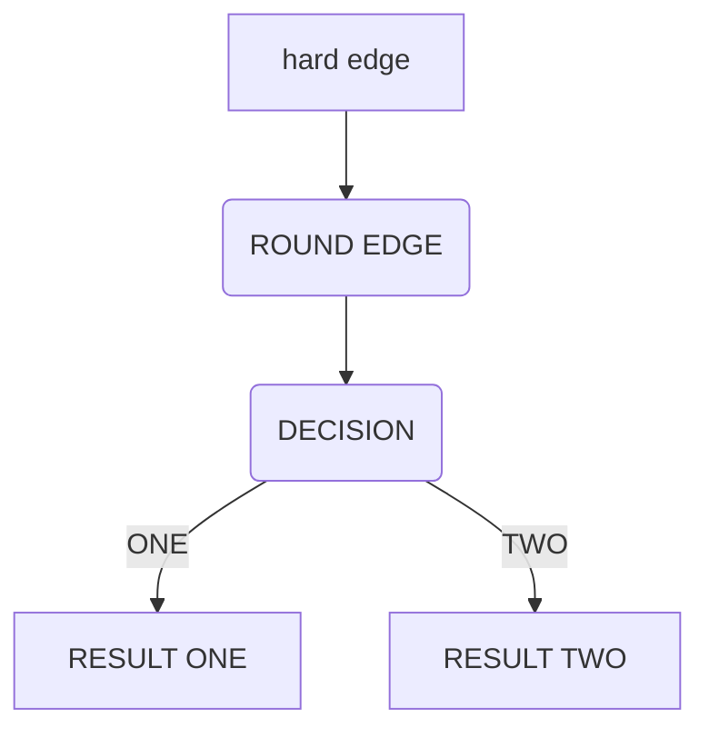
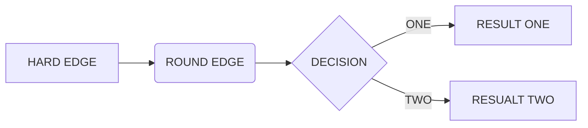
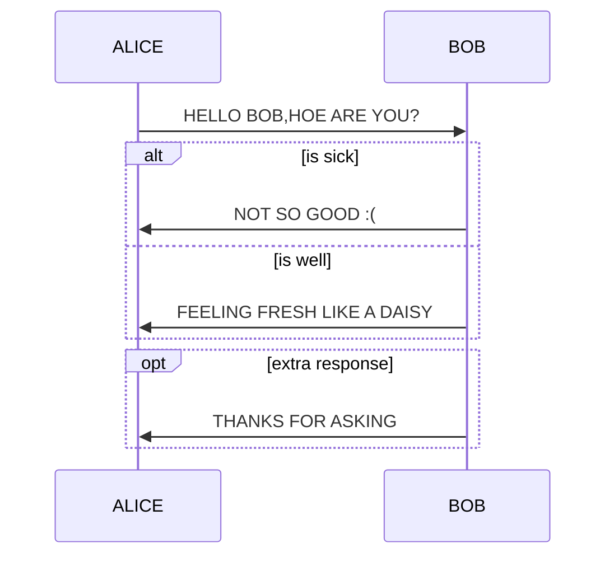
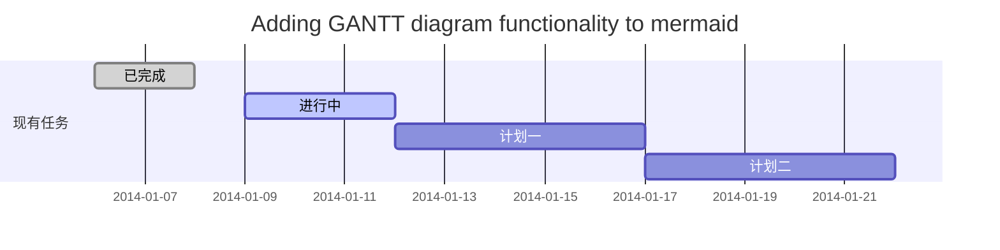
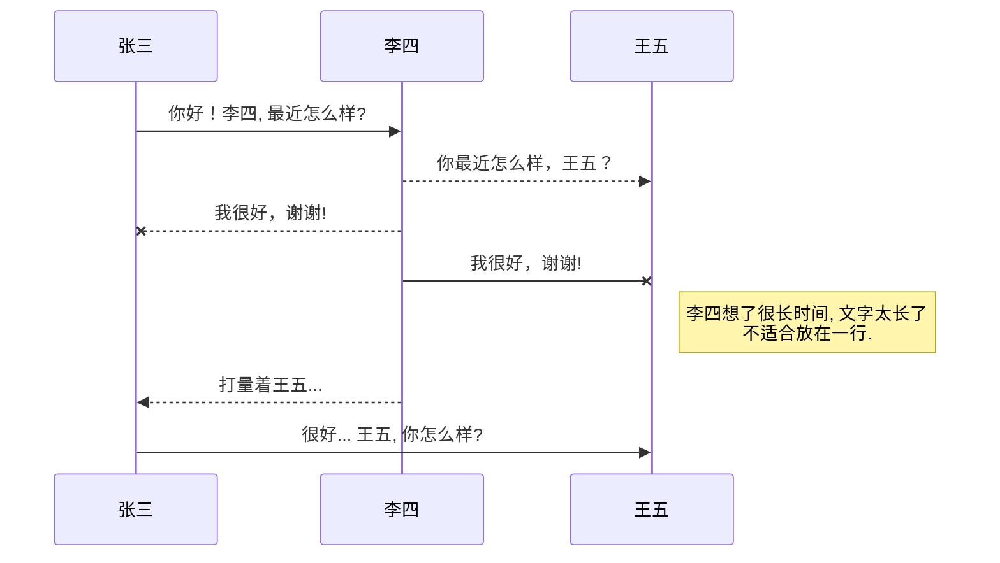
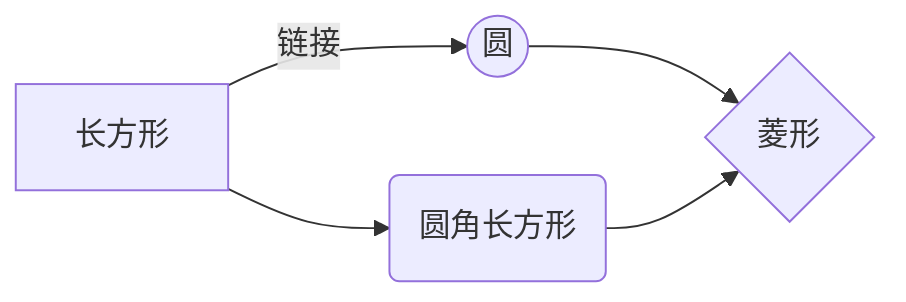

# 概述

1.数学公式环境

​	TEX有两种数学公式，一种是夹杂在行文段落中的公式，行内（inline）数学公式，或正文（in-text）数学公式；另一种是单独占据整行居中展示，称为显示（diaplayed）数学公式（或行间公式、列表公式）。

​	在TEX中，行内公式一般在前后单个$符号表示。

​	$$可以插入行间公式。

​	使用equation环境对行间公式进行编号。

2.控制序列

​	键盘不能直接表示的符号或者起着特定作用的皆有命令，类似转义，叫做控制序列（control sequence）。比如求和符号Σ对应的命令为\sum

3.分组

​	使用{……}将内容包含起来视作整体，比如上下标很长的时候。

LATEX中还定义了命令格式与环境格式的方式输入行内公式，即使用命令 \或是math环境括起一个行内公式。

基本的显示公式是不带编号的，在TEX中可以用连续两个美元符号$$界定。

latex提供带自动编号的数学公式，可以用equation环境表示，公式后还可以带引用的标签。

\begin{equation}

a+b=b+a\label{eq:commutative}

\end{equation}

$\text{被减数}-\text{减数}=\text{差}$

已知变量有$a$,$b$,$S$,$T$

# 数学结构

## 2.1上标和下标

TEX中上标用字符^表示，下标用特殊字符_表示。

$10^n$,$a_i$,


当上下标多于一个字符时，需要使用分组确定上下标范围，如：

$A_{ij}=2^{i+j}$


上下标同时使用，也可以嵌套使用。其中同时使用时，上下标先后次序不重要；嵌套使用时，外层一定要使用分组。如：

$A_i^k = B^k_i$

$K_{n_i} = K_{2^i} = 2^{n_i}$

这里数学公式中的空格（包括单个换行）不起实际作用，适当的空格可以将代码分隔的好看一些。


数学公式中的撇号'是一种特殊的上标，表示用符号\prime(即‘)作为上标。

$a=a'$,$b_0' = b_0''$,

${c'}^2 = (c')^2$

撇号可以与下标混用，也可以连续使用，但不能与上标直接混用。


latex默认的字体没有直接表示角度的符号，可以用符号\circ（即。）的上标表示

$A = 90^\circ$


多数的数学算子的上下标，位置在正上方或正下方

  $ \max_n f(n) = \sum_0^n A_i$

$\int_a^b f(x)$


在上下标前面用\limits命令会使上下标在正上正下方，使用\nolimits使上下标在角上。

$\iiint\limits_D \mathrm{d}f = \max\nolimits_D g$

$\int_0^1 f(t) \mathrm{d} t = \iint_D g(x,y) \mathrm{d}x\mathrm{d}y$


在左上、左下角加角标，在角标字符前面使用空的分组，给空分组加角标

${}_m^n H$

但是这种方法不标准，可能间距和对齐不合理，此时可用mathtools宏包的 \prescript{上标}{下标}{元素}来处理

$\prescript{n}{m}(H)_i^j < L$


给个别算子标记，不影响算子的上下限，可以用amsmath提供的 \sideset 命令

$\sideset{_a^b}{_c^d} \sum_{i=0}^n A_i = \sideset{}{'} \prod_k f_i $

还提供了\overset和 \underset命令，用来给任意符号的上下方添加标记

$\overset{*}{X}$,$\underset{*}{X}$,

$\overset{*}{\underset{\dag}{X}}$


TEX的上下标互不影响，因此$A_m^n$而不是$A_m{}^n$。

$A_m{}^n$,还可以使用“幻影”phantom

$A_m^{\phantom{m}n}$


$M\indices{^a_b}$


输入化学方程式，使用  \ce命令输入化学式

$\ce{2H2 + O2 ->[\text{燃烧}] 2H2O}$


## 2.2上下画线与花括号

使用\overline和\underline命令在公式上方和下方划横线

$$\overline{a+b} = \overline a + \overline b$$

$\underline a = (a_0, a_1, a_2, \dots)$

此结构可以任意嵌套或与其他数学结构组合

$\overline{\underline{\underline a} +\overline{b}^2} - c^{\underline n}$


amsmath提供了在公式上下加箭头的命令

$\overleftarrow{a+b}$

$\overrightarrow{a+b}$

$\overleftrightarrow{a+b}$

$\underleftarrow{a+b}$

$\vec x = \overrightarrow{AB}$


使用\overbrace和 \underbrace带上花括号

$\overbrace{a+b+c} = \underbrace{1+2+3}$

$\overbrace{a_0,a_1,\dots,a_n}^{\text{共 n+1项}} = {\underbrace{0,0,\dots,0}_{n},1}$。

$a+\overbrace{b+{\underbrace{c+d}_n}}^m+e+f$。

使用\rlap重叠，同时用\phantom占位，实现交错括号

$a+\rlap{\overbrace{\phantom{a+b+c}}} a +\underbrace{b+c+d}+f$


上取整和下取整表示：

$\lceil x \rceil$

$\lfloor x \rfloor$


## 2.3分式

使用\frac{分子}{分母}

$\frac{1}{2} + \frac 1a = \frac{2+a}{2a}$。

$\frac{1}{\frac    12     (a+b)} + \frac 1a = \frac{2+a}{2a}$。


指定较大或较小的分式，\dfrac和\tfrac分别指定显示格式（display style）和正文格式（text style）

$\tfrac 12 f(x) = \frac{1}{\tfrac 1a + \dfrac 1b + c}$。


连分式，使用\cfrac专用于输入连分式

$\cfrac{1}{1+\cfrac{2}{1+\cfrac{3}{1+x}}} = $。

$\sfrac 1a +b$,

$1/(a+b)$

$1/a +b$,


使用\binom来输入二项式系数，用法于\frac类似

$(a+b)^2 = \binom 20 a^2   +    \binom 21 ab    +  \binom 22 b^2$。


使用\genfrac{左括号}{右括号}{线宽}{大小}{分子}{分母}。线宽和大小为零表示默认指，大小可以是0，1，2，3，分别表\displaystyle    \textstyle  \scriptstyle  \scriptscriptstyle

$\genfrac {[} {]} {0pt} {} {n} {1} = (n-1)! ,\qquad n>0$


## 2.4根式

使用\sqrt得到，同时可以带一个可选参数[]，表示开方次数

$\sqrt 4 = \sqrt[3] {8}$

嵌套根式和其他数学结构

$\sqrt[n]{\frac{x^2 + \sqrt 2}{x+y}}$。


若开方次数不是简单的整数，或者被开方的内容过长（甚至超过一行），通常不使用根式的形式，而是该为等价的指数形式。

$(x^p + y^q)^{\frac{1}{1/p+1/q}}$。


开方次数的排版位置不合适，可以用\uproot和\leftroot命令进行调整，命令参数是整数，移动的单位是很小的一段距离。

$\sqrt[\uproot{10}\leftroot{-2}n]{\frac{x^2 + \sqrt 2}{x+y}}$。


根式的高度是随着内容改变的，但当几个根式并列时，有时需要调整统一的高度，可以使用\vphantom占位，

$\sqrt{\frac 12} < \sqrt{\vphantom{\frac12} 2 }$。


数学支架\mathstrut表示有一个圆括号高度和深度的支架，它常用来平衡不同高度和深度的字母。

$\sqrt b    \sqrt y$,调整为：

$\sqrt{\mathstrut b}  \sqrt{\mathstrut y}$。


$\sqrt[4]{\frac xy}$


## 2.5矩阵

矩阵matrix是用\matrix和\pmatrix排版的，

matrix环境：

a    b

c     d

bmatrix环境

[a   b]

vmatrix环境：

|a   b|

pmatrix环境：

（a   b）

Bmatrix环境：

{a   b}

Vmatrix环境：

║  a    b║


在矩阵环境中，不同的列用符号“&”隔开，行用两条\分隔，矩阵的每列中的元素居中对齐。

$A = \pmatrix{ a_{11} & a_{12}  & a_{13} \\ 0 & a_{22} & a_{23}  \\ 0 & 0 & a_{33}}$.


矩阵中经常使用各种省略号，包括\dots, \vdots,  \ddots等

$A= \pmatrix{a_{11} & \dots & a_{1n} \\ & \ddots & \vdots \\ 0 & & a_{nn}}_{n\times n}$。


通过两个$方式输出其他形似矩阵


$$
A= \begin{bmatrix}
  a_{11} & \dots & a_{1n} \\
  & \ddots & \vdots \\
  0 & & a_{nn}
  \end{bmatrix}_{n\times n}
$$

$$
A= \begin{Vmatrix}
  a_{11} & \dots & a_{1n} \\
  & \ddots & \vdots \\
  0 & & a_{nn}
  \end{Vmatrix}_{n\times n}
$$


写增广矩阵，可以用array命令来处理
$$
A= \left[
     \begin{array}{c|cc}
      1 & 2 & 3 \\
      4 & 5 & 6 \\
      0 & 3 & 4
  \end{array}
   \right]
$$

$$
A= \left[
     \begin{array}{cc|c}
      1 & 2 & 3 \\
      4 & 5 & 6 \\
      0 & 3 & 4
  \end{array}
   \right]
$$

$$
A= \left[
     \begin{array}{c:cc}
      1 & 2 & 3 \\
      4 & 5 & 6 \\
      0 & 3 & 4
  \end{array}
   \right]
$$

$$
A= \left[
     \begin{array}{c:c:c}
      1 & 2 & 3 \\
      4 & 5 & 6 \\
      0 & 3 & 4
  \end{array}
   \right]
$$

分块矩阵
$$
A=\begin{pmatrix}
 \begin{matrix} 1&0 \\0&1 \end{matrix}
 &{\large 0}\\
  {\large 0}&
 \begin{matrix} 1&0\\0&-1
 \end{matrix}
 \end{pmatrix}
  
$$
在行内公式，有时候需要很小的矩阵，可以用smallmatrix环境得到，需要手工在外面添加 括号。如：

复数$z=(x,y)$也可用矩阵
$$
\left(
\begin{smallmatrix}
x& -y \\y &x
\end{smallmatrix}
\right)
$$
来表示


在上下标特别是求和式的上下限中，有时候需要使用好几行的内容，此时可以用amsmath提供的\substack命令排版，效果相当于只有一列的没有括号的矩阵。

$\sum_{\substack{0<i<n \\0<j<i}} A_{ij}$
$$
\max_n f(n) = \sum_{\substack{0<i<n\\0<j<i}} A_{ij}
$$

$$
\max_n f(n) = \sum_{\substack{0<i<n\\0<j<i\\k<1000}} X(i,j,k)
$$


matrix等矩阵环境默认至多只有10列，最大计算由计数器MaxMatrixCols控制，可以通过\setcounter等计数器命令临时或全局调整。（目测typora没有这限制）
$$
\begin{Bmatrix}
0&0&0&0&0&0&0&0&0&0&1&1&1&1&1\\
0&0&0&0&0&0&0&0&0&0&1&1&1&1&1
\end{Bmatrix}
$$


$$
\left[
\matrix{
    &1 &2 &3\\
  1  &A &B &C\cr
  2  &D &E &F\cr}
   
    \right]
  
$$

注意一个问题：
$$
\left[
\begin{matrix}
V_A \\
V_B \\
V_C \\
\end{matrix}
\right] =
\left[
\begin{matrix}
1 & 0& \dots & L \\\\
-cosψ & sinψ & \dots & L \\\\
\vdots& \vdots& \ddots & \vdots \\
-cosψ & -sinψ & \dots & L
\end{matrix}
\right]
\left[
\begin{matrix}
V_x \\\\
V_y \\\\
W \\\\
\end{matrix}
\right]
$$
或者采用：

$\left[\begin{matrix}V_A \\V_B \\V_C \\\end{matrix}\right]$

矩阵可以在hexo博客中很好的被渲染。

## 2.6 特殊字符

各种希腊字母表：

$\alpha,$$\theta,\tau,\beta,\vartheta,\pi,\upsilon,\gamma,\iota,\varpi,\phi,\delta,\kappa,\rho,$$\varphi,\epsilon,\lambda,\varrho,\chi,\varepsilon,\mu,\sigma,\psi,\zeta,\nu,\varsigma,$$\omega,\eta,\xi,\Gamma,\Lambda,\Sigma,\Psi,\Delta,\Xi,\Upsilon,\Omega,\Theta,\Pi,\Phi,o$.







省略号：$\dots$

$\cdots$

求积$\prod$

求和：$\sum_1^n$

积分：$\int_1^n$

极限： $lim_{x \to \infty}$

$\hat{\theta}$,加^号

$\widehat{x}$

$\Join$

$\overline{x}$，加横线

$\widetilde{x}$加波浪线

$\dot{x}$，加一个点

$\ddot{x}$，加两个点

latex公式编辑情况下对数字、字母加粗方式：\pmb

$\pmb x=[x_1,x_2,……,x_n]^T$。

$\pmb 3!$

实数集 $\mathbb{R}^n$


\pm 表示$\pm$

 $\pmb x \in \cases{w_1\\w_2}$

$\Arrowvert$

$\arrowvert$

$\forall$

$\exists$

$\mathcal{XABC}$

$||x||_{\infty} = \max \limits_{i}|x_i|$

$\sim$

$\rm Laplace$

## 2.7 数学公式输入

latex大括号及多行公式，array中的lr表示居右，居左，居中。


$$
\begin{equation}
\left\{
             \begin{array}{lr}
             a_1x+b_1y+c_1z=l  \\
             a_2x+ b_2y+c_2z=m\\
             a_3x+b_3y+c_3z=n
             \end{array}
\right.
\end{equation}
$$

$$
\begin{equation}
\left\{
             \begin{array}{lr}
             x=\dfrac{3\pi}{2}(1+2t)\cos(\dfrac{3\pi}{2}(1+2t))  \\
             y=s, & 0\leq s\leq L,|t|\leq1.\\
             z=\dfrac{3\pi}{2}(1+2t)\sin(\dfrac{3\pi}{2}(1+2t)) 
             \end{array}
\right.
\end{equation}
$$


$$
\begin{equation*}
\begin{aligned}
p(x|\mu,\sigma^2)&=\frac{1}{(2\pi\sigma^2)^{1/2}}exp\{-\frac{1}{2\sigma^2}(x-\mu)^2\}\\
&=\frac{1}{(2\pi\sigma^2)^{1/2}}exp\{-\frac{1}{2\sigma^2}x^2+\frac{\mu}{\sigma^2}x-\frac{1}{2\sigma^2}\mu^2\}\\
&= h(x)g(\eta)exp(\eta^T u(x))
\end{aligned}
\end{equation*}
$$
用两条“\\”表示换行，&表示对齐点。


分段函数输入：
$$
\begin{equation}
k(x-y)=
\begin{cases}
1: &\mbox{$|x_i-y_j| \leq \frac{1}{2} $(i=1,...,D)}\\
0: &\mbox{otherwise}
\end{cases}
\end{equation}
$$


公式中的空格表示：

两个quad空格： $a\qquad b$,两个m宽度

 $a\quad b$,     一个m宽度

 $a\ b$,       1/3m宽度

 $a\;b$,       2/7m宽度

 $a\,b$,       1/6m宽度

 $ab$,       没有空格

 $a\!b$,       缩进1/6m宽度


## 2.8块级公式编号

直接使用块级代码`$$x^n+y^n=z^n$$`不会生成编号，而使用\tag{...}标签就可以生成对应的编号。
$$
x^n +y^n =z^n \tag{1.1}
$$
公式引用直接用`$编号$`即可。

如对于：
$$
a^2 + b^2 =c^2 \tag{1.2}
$$
由公式$(1.2)$即可得到结论。


## 2.9详细的数学公式输入见此处

更多$\LaTeX$数学公式见[此处](<https://khan.github.io/KaTeX/docs/supported.html>)


## 2.10下标

如果是数学符号，直接在`_`前加上`\limits`命令放在正下方

$f(x,y) = \frac{mn}{\sum\limits_{(s,t) \in S_{x,y}} \frac{1}{g(X,y)}} $

如果是普通符号，用`\mathop`先转成数学符号再用`\limits`

对于双美元符号之间的公式，默认是放在正下方，不需要加`\limits`。


# 画图表 






```flow
st=>start: start
op=>operation: your operation
cond=>condition: yes or no?

e=>end

st->op->cond
cond(yes)->e
cond(no) ->op
```

```flow
st=>start: 开始
op1=>operation: 确定控制参数t=0
op2=>operation: 随机产生初始种群pop(0)
op3=>operation: 对初始种群进行评价
op4=>operation: 对于当前种群pop(t)，
for(int i=0;i<pop_size;i++)
{
     对第i个体进行差分变异产生相应的变异个体，
     然后和变异个体实施交叉操作，
     生成试验个体
}
op5=>operation: 对试验个体组成的临时种群进行评价
op6=>operation: 通过选择操作确定下一代新种群pop(t+1)
op7=>operation: t=t+1
cond=>condition: 是否满足终止条件
sub1=>subroutine: 子流程
io=>inputoutput: 输出最优解
e=>end: 输出最优解

st->op1->op2->op3->cond
cond(no,down)->op4->op5
op5->op6->op7
op7(right)->cond
cond(yes)->e
```


```sequence
ALICE->BOB: HELLO ,HOW ARE YOU?
NOTE RIGHT OF BOB: BOB THANKS
BOB->ALICE: I AM GOOD THANKS
```





```mermaid
gantt
dateformat 2019-03-24
title adding gantt diagram functionality to memaid


        Completed task            :  des1, 3d  
        Active task               :  des2,  3d
        Future task               :         des3, after des2, 5d
        Future task2               :         des4, after des3, 5d

        section Critical tasks
        Completed task in the critical line :crit, done, 2014-01-06,24h
        Implement parser and jison          :crit, done, after des1, 2d
        Create tests for parser             :crit, active, 3d
        Future task in critical line        :crit, 5d
        %%Create tests for renderer           :2d
       %% Add to mermaid                      :1d

        section Documentation
        Describe gantt syntax               :active, a1, after des1, 3d
        Add gantt diagram to demo page      :after a1  , 20h
        Add another diagram to demo page    :doc1, after a1  , 48h

        section Last section
        Describe gantt syntax               :after doc1, 3d
        Add gantt diagram to demo page      : 20h
        Add another diagram to demo page    : 48h
```

$$
\begin{array}{c|lcr}
n & \text{Left} & \text{Center} & \text{Right} \\\\
\hline
1 & 1.97 & 5 & 12 \\\\
2 & -11 & 19 & -80 \\\\
3 & 70 & 209 & 1+i \\\\
\end{array}
$$

# 代办事宜todo列表

- [ ] **Cmd Markdown 开发**
    - [ ] 改进 Cmd 渲染算法，使用局部渲染技术提高渲染效率
    - [ ] 支持以 PDF 格式导出文稿
    - [x] 新增Todo列表功能 [语法参考](https://github.com/blog/1375-task-lists-in-gfm-issues-pulls-comments)
    - [x] 改进 LaTex 功能
        - [x] 修复 LaTex 公式渲染问题
        - [x] 新增 LaTex 公式编号功能 [语法参考](http://docs.mathjax.org/en/latest/tex.html#tex-eq-numbers)
- [ ] **七月旅行准备**
    - [ ] 准备邮轮上需要携带的物品
    - [ ] 浏览日本免税店的物品
    - [x] 购买蓝宝石公主号七月一日的船票

使用带有 [ ] 或 [x] （未完成或已完成）项的列表语法撰写一个待办事宜列表，并且支持子列表嵌套以及混用Markdown语法。


@[TOC](这里写自定义目录标题)

# 欢迎使用Markdown编辑器

你好！ 这是你第一次使用 **Markdown编辑器** 所展示的欢迎页。如果你想学习如何使用Markdown编辑器, 可以仔细阅读这篇文章，了解一下Markdown的基本语法知识。

## 新的改变

我们对Markdown编辑器进行了一些功能拓展与语法支持，除了标准的Markdown编辑器功能，我们增加了如下几点新功能，帮助你用它写博客：

  1. **全新的界面设计** ，将会带来全新的写作体验；
  2. 在创作中心设置你喜爱的代码高亮样式，Markdown **将代码片显示选择的高亮样式** 进行展示；
  3. 增加了 **图片拖拽** 功能，你可以将本地的图片直接拖拽到编辑区域直接展示；
  4. 全新的 **KaTeX数学公式** 语法；
  5. 增加了支持**甘特图的mermaid语法[^1]** 功能；
  6. 增加了 **多屏幕编辑** Markdown文章功能；
  7. 增加了 **焦点写作模式、预览模式、简洁写作模式、左右区域同步滚轮设置** 等功能，功能按钮位于编辑区域与预览区域中间；
  8. 增加了 **检查列表** 功能。

[^1]: [mermaid语法说明](https://mermaidjs.github.io/)

## 功能快捷键

撤销：<kbd>Ctrl/Command</kbd> + <kbd>Z</kbd>
重做：<kbd>Ctrl/Command</kbd> + <kbd>Y</kbd>
加粗：<kbd>Ctrl/Command</kbd> + <kbd>B</kbd>
斜体：<kbd>Ctrl/Command</kbd> + <kbd>I</kbd>
标题：<kbd>Ctrl/Command</kbd> + <kbd>Shift</kbd> + <kbd>H</kbd>
无序列表：<kbd>Ctrl/Command</kbd> + <kbd>Shift</kbd> + <kbd>U</kbd>
有序列表：<kbd>Ctrl/Command</kbd> + <kbd>Shift</kbd> + <kbd>O</kbd>
检查列表：<kbd>Ctrl/Command</kbd> + <kbd>Shift</kbd> + <kbd>C</kbd>
插入代码：<kbd>Ctrl/Command</kbd> + <kbd>Shift</kbd> + <kbd>K</kbd>
插入链接：<kbd>Ctrl/Command</kbd> + <kbd>Shift</kbd> + <kbd>L</kbd>
插入图片：<kbd>Ctrl/Command</kbd> + <kbd>Shift</kbd> + <kbd>G</kbd>


## 合理的创建标题，有助于目录的生成

直接输入1次<kbd>#</kbd>，并按下<kbd>space</kbd>后，将生成1级标题。
输入2次<kbd>#</kbd>，并按下<kbd>space</kbd>后，将生成2级标题。
以此类推，我们支持6级标题。有助于使用`TOC`语法后生成一个完美的目录。


## 如何改变文本的样式

*强调文本* _强调文本_

**加粗文本** __加粗文本__

==标记文本==

~~删除文本~~

> 引用文本

H~2~O is是液体。

2^10^ 运算结果是 1024.


## 插入链接与图片

链接: [link](https://mp.csdn.net).

图片: 

带尺寸的图片: 

居中的图片: 

居中并且带尺寸的图片: 

当然，我们为了让用户更加便捷，我们增加了图片拖拽功能。


## 如何插入一段漂亮的代码片

去[博客设置](https://mp.csdn.net/configure)页面，选择一款你喜欢的代码片高亮样式，下面展示同样高亮的 `代码片`.

```javascript
// An highlighted block
var foo = 'bar';
```


## 生成一个适合你的列表

- 项目
  - 项目
    - 项目

1. 项目1
2. 项目2
3. 项目3

- [ ] 计划任务
- [x] 完成任务


## 创建一个表格

一个简单的表格是这么创建的：

| 项目 | Value |
| ---- | ----- |
| 电脑 | $1600 |
| 手机 | $12   |
| 导管 | $1    |

### 设定内容居中、居左、居右

使用`:---------:`居中
使用`:----------`居左
使用`----------:`居右

|     第一列     |         第二列 | 第三列         |
| :------------: | -------------: | :------------- |
| 第一列文本居中 | 第二列文本居右 | 第三列文本居左 |


### SmartyPants

SmartyPants将ASCII标点字符转换为“智能”印刷标点HTML实体。例如：
|    TYPE   |ASCII                          |HTML                         
|----------------|-------------------------------|-----------------------------|
|Single backticks|`'Isn't this fun?'`            |'Isn't this fun?'            |
|Quotes          |`"Isn't this fun?"`            |"Isn't this fun?"            |
|Dashes          |`-- is en-dash, --- is em-dash`|-- is en-dash, --- is em-dash|


## 创建一个自定义列表

Markdown
:  Text-to-HTML conversion tool

Authors
:  John
:  Luke


## 如何创建一个注脚

一个具有注脚的文本。[^2]

[^2]: 注脚的解释


##  注释也是必不可少的

Markdown将文本转换为 HTML。

*[HTML]:   超文本标记语言


## LaTeX数学公式

您可以使用渲染LaTeX数学表达式 [KaTeX](https://khan.github.io/KaTeX/):

Gamma公式展示 $\Gamma(n) = (n-1)!\quad\forall
n\in\mathbb N$ 是通过欧拉积分

$$
\Gamma(z) = \int_0^\infty t^{z-1}e^{-t}dt\,.
$$

> 你可以找到更多关于的信息 **LaTeX** 数学表达式[here][1].


## 新的甘特图功能，丰富你的文章



- 关于 **甘特图** 语法，参考 [这儿][2],

## UML 图表

可以使用UML图表进行渲染。 [Mermaid](https://mermaidjs.github.io/). 例如下面产生的一个序列图：:



这将产生一个流程图。:



- 关于 **Mermaid** 语法，参考 [这儿][3],

## FLowchart流程图

我们依旧会支持flowchart的流程图：

```mermaid
flowchat
st=>start: 开始
e=>end: 结束
op=>operation: 我的操作
cond=>condition: 确认？

st->op->cond
cond(yes)->e
cond(no)->op
```

- 关于 **Flowchart流程图** 语法，参考 [这儿][4].


## 导出与导入

###  导出

如果你想尝试使用此编辑器, 你可以在此篇文章任意编辑。当你完成了一篇文章的写作, 在上方工具栏找到 **文章导出** ，生成一个.md文件或者.html文件进行本地保存。

### 导入

如果你想加载一篇你写过的.md文件或者.html文件，在上方工具栏可以选择导入功能进行对应扩展名的文件导入，
继续你的创作。

[1]: http://meta.math.stackexchange.com/questions/5020/mathjax-basic-tutorial-and-quick-reference
[2]: https://mermaidjs.github.io/
[3]: https://mermaidjs.github.io/
[4]: http://adrai.github.io/flowchart.js/


# word&PPT插入公式

## 基本操作

在Word中任意位置按下`Alt`+`=`（Mac中是`Control`+`=`）可以切换公式编辑，或者选中文字按下`Alt`+`=`把它变成公式，再按Ctrl+I可以设置成斜体。输入内置公式或者拷入的公式可以按Enter可以整体格式化。对于格式化的公式可以选择“线性”格式查看原始文字。在公式编辑中，快捷命令通过空格可以立即转换成格式化后的公式形式，因此当公式没有按照你想要的形式生成时可以按空格试试。

在PPT中`插入`->`公式`，语法与word中插入类似。

[具体参考此篇博文](https://zyxin.xyz/blog/2017-08/WordMath/)