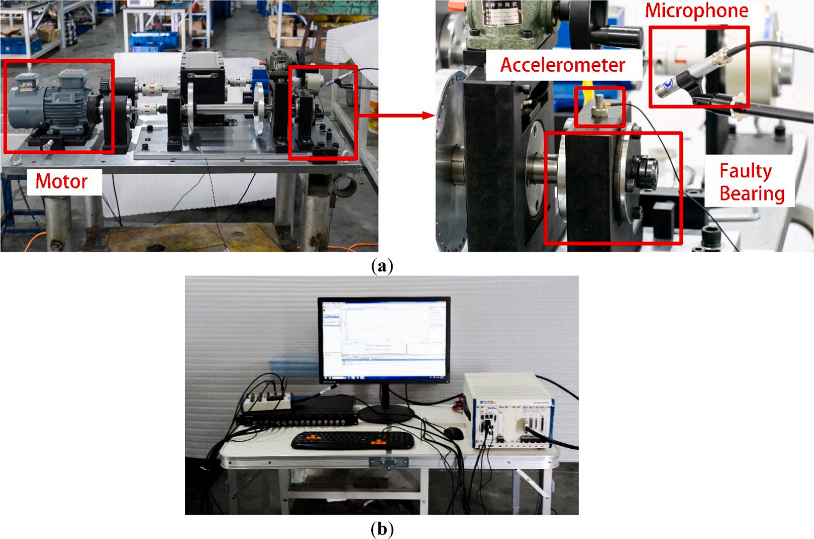
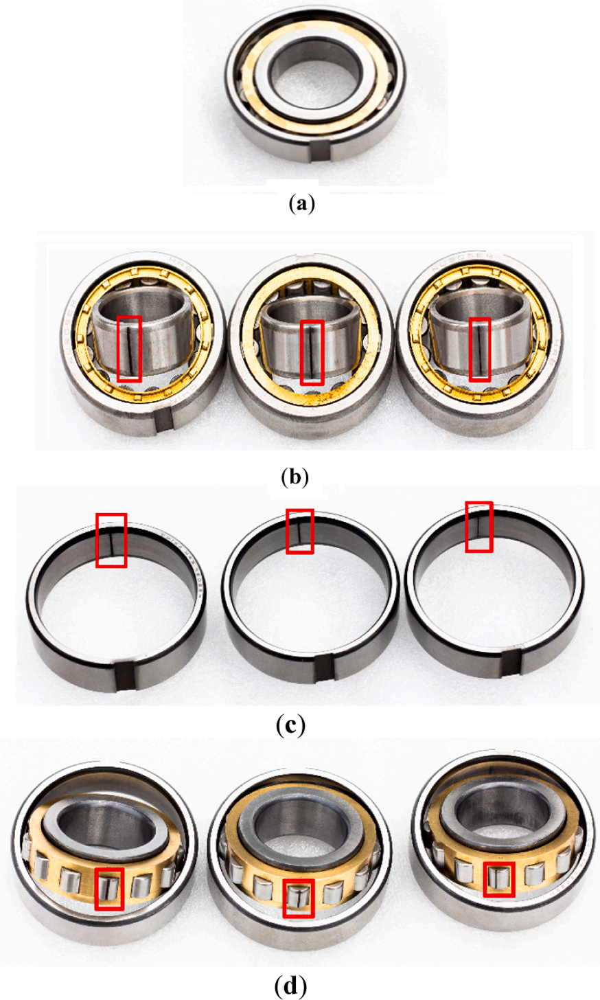
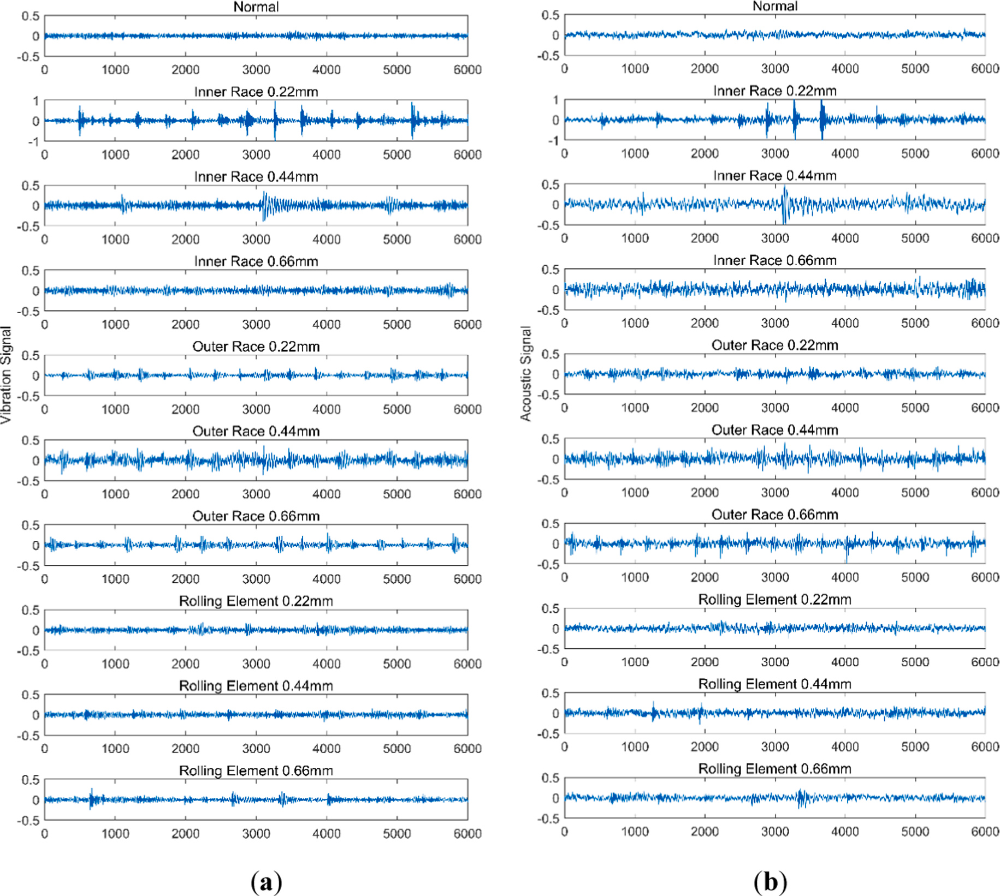
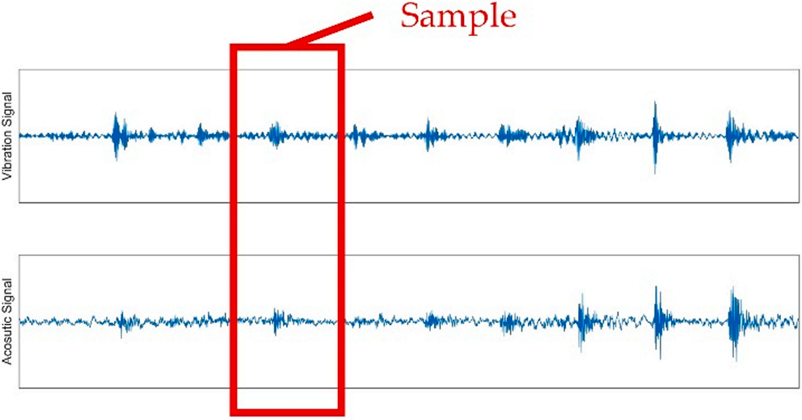
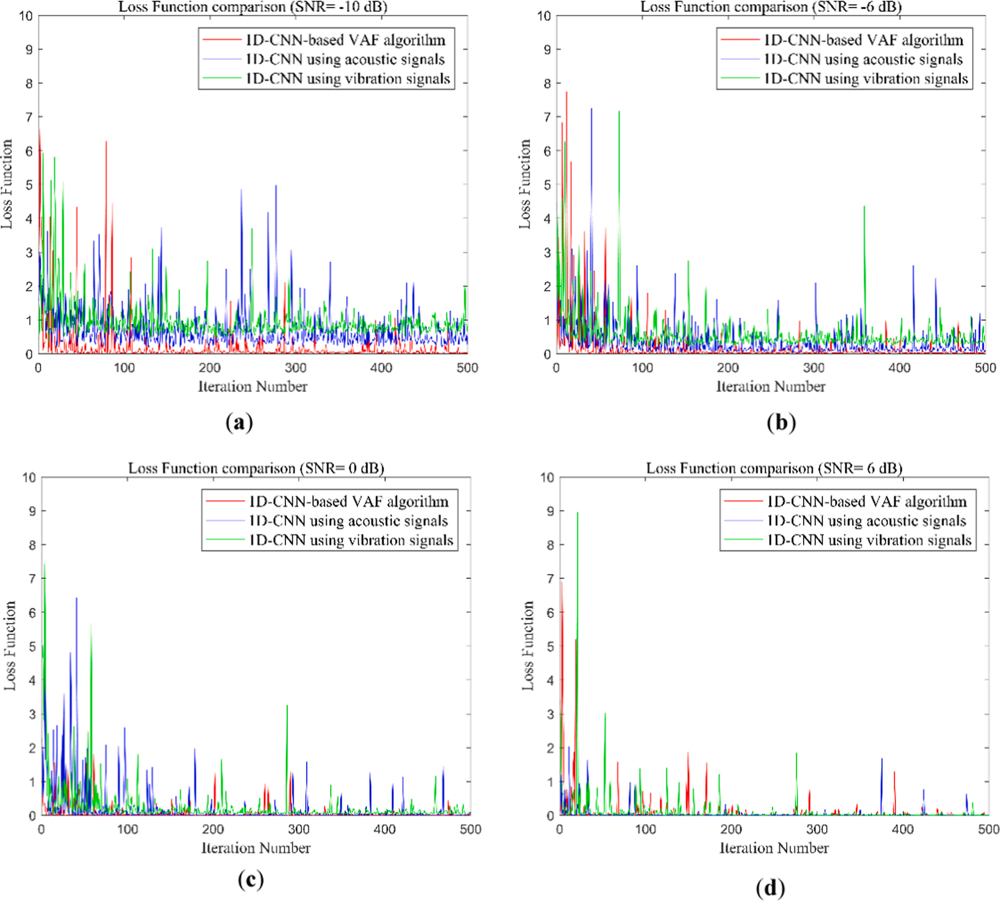
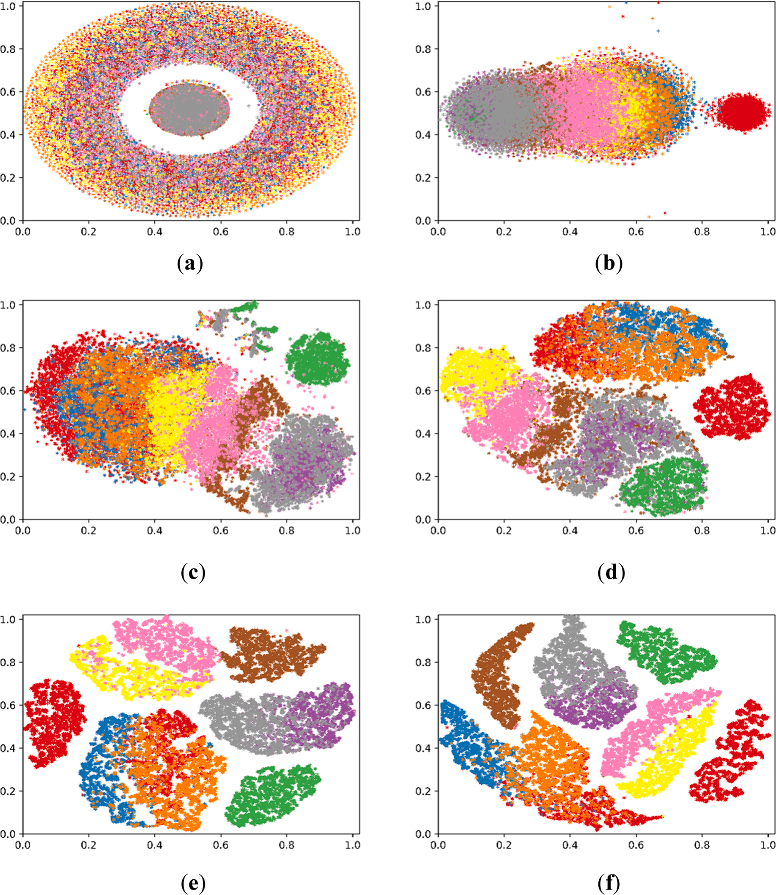
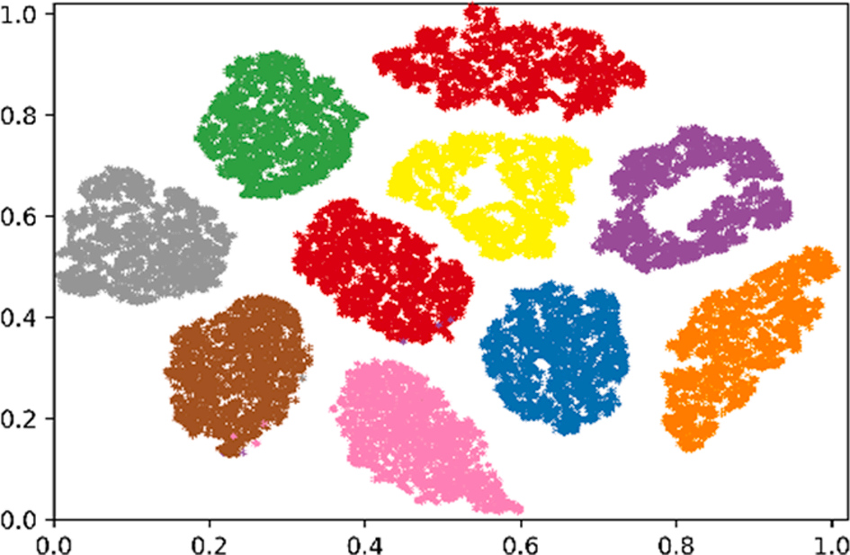
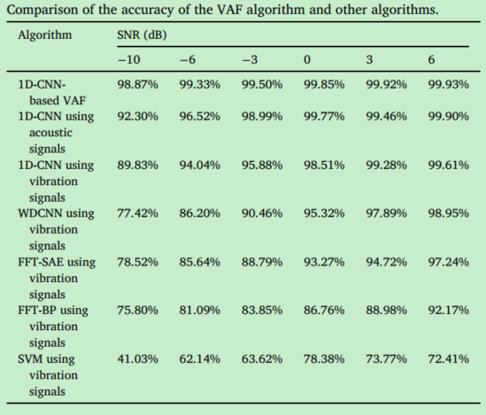

> 论文名称：《bearing fault diagnosis based on vibro-acoustic data fusion and 1D-CNN network》
>
> 论文地址：https://www.sciencedirect.com/science/article/pii/S0263224120310447
>
> 论文解读参考：
>
> 论文代码参考：

## Background

轴承故障诊断是旋转机械设备维护不可或缺的一部分，其中基于振动和基于声音信号（vibration-based and acoustics-based）的轴承故障诊断是两个主流的方法。

vibration-based方法好处是计算代价低，测量快；acoustics-based方法是不接触被测对象。

轴承故障诊断算法主要在于两点：signal-feature extraction和pattern recognition。

信号特征提取方法包括：

- Fast Fourier Transform
- Wavelet transform
- Empirical mode decomposition（经验模态分解）
- Variational modal decomposition（变分模态分解）
- Statistical characteristics of signals etc.

模式识别方法包括：

- Support vector machines
- BP neural networks
- Bayesian classifiers
- Nearest neighbor classifiers etc.

相对来说，deep learning 的优势在于摆脱人工特征提取和对专家知识的依赖，如在模式识别和医学工程中应用较多的CNN。

## Related work

**CNN用在故障诊断的一些研究**：

1、变速箱（gearbox）的故障诊断，利用时频域特征作为CNN的输入进行故障识别。

2、将振动信号频谱的大小（magnitude of the spectrum）作为训练样本导入到CNN，相比于传统的特征提取和分类方法，准确率提高了6%。

3、以原始数据（raw data）作为输入，构建WDCNN故障诊断模型，成功应用在滚动轴承故障诊断。

> WDCNN（第一层宽卷积核深度卷积神经网络），其结构特点是第一层是大卷积核，之后的卷积层全部为3×1的小卷积核【张伟. 基于卷积神经网络的轴承故障诊断算法研究[D].】

**多模态表示学习：**

目前很多故障诊断方法是基于单模态测量（single-modal measurement），包括一些深度学习方法。信号是通过单模态传感器（加速度计或者麦克风）采集，这样的测量经常会忽略故障的复杂性，此外，单模态传感器可能会有测量遗漏，且易受到外部噪声干扰。

multi-modal-based方法可以降低漏检率，提高故障诊断的正确率。

传统的多模态传感器融合方法是通过人工提取多模态传感器特征，并简单的构建成长向量来实现数据融合。

近些年，利用多模态传感器融合方法结合深度神经网络来进行故障诊断，相关工作有：

1、深度耦合的自编码网络（deep coupled auto-encoder network），用于振动和声传感器数据融合，实现齿轮轴承故障诊断。

2、深度耦合的受限玻尔兹曼机（deep coupled restricted Boltzmann machine），实现刀具振动与声发射传感器的数据融合。

3、使用CNN-LSTM网络来监测轴承故障。

这些方法在使用的时候存在一个问题：没有考虑在有噪声环境下，方法的有效性和可靠性。

## Proposed method

提出了一种基于1D-CNN的振动-声传感器的数据融合算法（1D-CNN-based vibro-acoustic sensor data fusion（VAF）algorithm）。

the signals simultaneously collected by two different modal sensors, an accelerometer and a microphone.

1D-CNN-based用于特征提取；fusion stage用于提取的特征的融合；最后通过softmax classifier进行故障类型分类。

实验通过在不同噪声环境下，分别基于该方法和基于单模态信号，来证明具有较高的诊断正确率。

对不同噪声环境下的轴承故障信号进行可视化分析，谈到算法的内在机理，并与现有算法进行性能比较。

### 1D-CNN algorithm

1D-CNN 包括五个卷积层，五个池化层，一个全连接层和一个softmax分类层。

第一个卷积层将输入信号转化为特征映射，然后下采样到最大池化层。重复四次，连接到全连接层，然乎通过ReLU激活函数转移到softmax层。

模型参数如下：

This model has five convolutional layers and pooling layers. The size of the convolution kernel is 64 × 1 at layer 1, 32 × 1 at layers 2 and 3, and 16 × 1 at layers 4 and 5. The size of the pooling kernel is 16 × 1 at layer 1, 2 × 1 at layers 2, 3, 4 and 5. The node number is 100 at the fully connected layer, and there are 10 outputs at the softmax layer, corresponding to the 10 states of bearing faults in the experiment.

其中全连接层得节点为100，softman层输出为10，对应10种故障状态。

### 1D-CNN-based VAF algorithm

算法主要可以分为三个部分：

①multi-modal sensor feature extraction stage

振动和声信号特征提取都是用5层卷积-池化结构

②fusion stage 

所有提取到得振动和声信号特征输入到全连接层进行特征融合

③classification stage

融合的特征导入到softmax分类层，进行故障信号分类。

1D-CNN-based VAF算法是可训练的，其中损失函数定义为估计的softmax输出的概率分布与目标类别概率分布之间的交叉熵。

$H(p,q)=-\sum\limits_{x}p(x)\log q(x)$，其中$p(x)$是目标概率分布，$q(x)$是算法估计的概率分布。

## Experiments

### 实验平台

实验装置包括一个发动机、一个加速度传感器（vibration signals）、一个麦克风（acoustic signals）、一套数据采集系统（NI PXIe-8153和PXIe-6358）、10组轴承（N205）

使用的传感器参数：

| Sensor        | Type          | Frequency Range | Sensitivity    |
| ------------- | ------------- | --------------- | -------------- |
| Accelerometer | B&K type 4397 | 0-25,000        | 1 $mv/ms^{-2}$ |
| Microphone    | B&K type 4189 | 20-20,000       | 50 $mv/Pa$     |

十组实验轴承：

（a）正常轴承； 

（b）内圈故障规格为0.22 mm，0.44 mm和0.66 mm的轴承;

（c）外圈故障规格为0.22 mm，0.44 mm和0.66 mm的轴承; 

（d）滚动体故障规格为0.22 mm，0.44 mm和0.66 mm的轴承

十组数据标签分类为0-9，共10组。

发动机转速1480 rpm，采样频率48 KHz，每个信号长度为1,920,000个采样点。

每组随机采集2700个样本，每个样本包括2048个振动信号值和2048个声信号值。

训练和测试数据集划分如下：

为了模拟现实环境，引入了不同SNRs的高斯噪声（-10dB、-6dB、0dB、6dB）。

## Results and Discussion

### The accuracy of 1D-CNN-based VAF algorithm

#### 损失函数

通过损失函数进行评价。损失函数是衡量预测值和实际神经网络输出值之间的误差大小。（？？？预测值怎么计算）

即预测值和实际值误差越小，算法性能越好。通过将每次迭代得到的预测值插入描述损失函数的交叉熵公式种，得到损失函数值。500次迭代后得到的结果如下：

随着迭代次数增加，损失函数曲线呈下降趋势，即算法准确率逐渐提高。

信噪比高（0/6dB），基于单个信号和基于融合信号的算法收敛速度基本相同；信噪比低（-10/-6dB），1D-CNN-based VAF算法收敛速度更快。

#### 准确率

准确率是指对于给定的测试数据集，分类器正确分类的样本数量/总样本数，直接反映算法的分类性能。

### The t-SNE visualization analysis

t-SNE是一种可视化算法，将数据点之间的高维欧式距离转化为表示相似度的条件概率。t-SNE可以通过将数据集投影到二维或3维空间中来判断其是否具有良好的可除性，即，同质组之间的间隔是否较小，异质组之间的间隔是否较大？

为研究1D-CNN-based VAF算法的内在机理，在可视化分析种使用了轴承故障样本的一个数据集，相应的添加了高斯噪声到原始数据种，SNR=-6 dB。

(a) and (b) shows that the features of **the vibration signals** in the original time domain can hardly be separated from the data at the first convolutional layer. In (c) and (d), the features obtained after two or three convolutional layers are still not completely divided but the feature distributions start to show a trend of separation. In (e) and (f), the features obtained after four or five convolutional layers have been gradually separated.

(a) and (b) shows that the features of **the acoustic signals** in the original time domain can hardly be separated from the data at the first convolutional layer. In (c) and (d), the features obtained after two or three convolutional layers are still not completely divided, but the feature distributions start to show a trend of separation. In (e) and (f), the features obtained after four or five layers of convolution have been gradually separated

the features of the vibration and acoustic signals after the fifth convolutional layer are imported into the FC layer at the fusion stage for visual display.

t-SNE可视化算法揭示了1D-CNN-based VAF算法的内部机制，由于组合特征相对于单模态特征 能获取的信息更多，因此基于多模态传感器的特征可视化结果相比于振动特征或声学特征的可视化结果更明显。

### 不同算法之间的准确率比较

the 1D-CNN-based VAF algorithm is compared with the 1D-CNN algorithm based on vibration signals, the 1D-CNN algorithm based on acoustic signals, as well as some widely adopted algorithms in bearing fault diagnosis such as the WDCNN , FFT-BP , FFT-SAE and SVM algorithms, which are all based on vibration signals.

## Conclusion

本文提出了一种用在振动和声信号融合的轴承故障诊断方法，1D-CNN-based VAF algorithm，并在不同信噪比高斯噪声环境下验证了其更好了故障诊断准确率。使用了t-SNE可视化算法解释了神经网络结构的内在机理。

相较于单模态的振动信号或声信号，多模态传感器融合的方法可以提取更完整的特征，可以把振动信号和声信号特征互补融合。