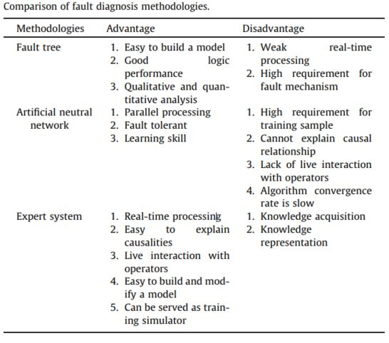
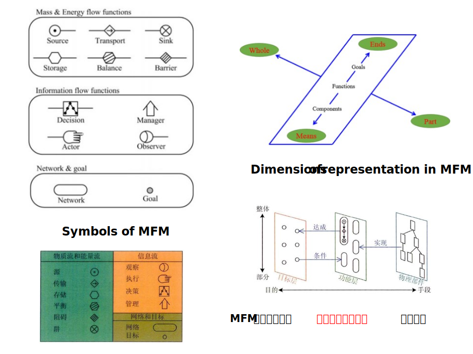
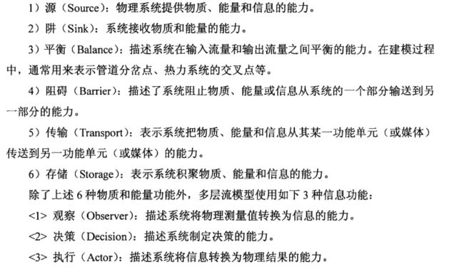

> [1]Wenlin Wang et al. **Development of a rule-based diagnostic platform on an object-oriented expert system shell**,Annals of Nuclear Energy,2016,252-264.
>
> [2]王文林. 基于专家系统的核动力装置故障诊断方法研究[D].哈尔滨工程大学,2016.
>
> [3]杨明. 基于多层流模型的核动力装置可靠性分析及故障诊断方法研究[D].哈尔滨工程大学,2013.

## ABSTRACT/研究思路

本文提出了一个实时的基于规则的故障诊断平台。方法包括：

（1）建立相应的类（classes）和实例（instances）以构建**领域图**（domain map）

（2）基于事件创建通用故障模型（generic fault models）

（3）基于规则构建诊断推理

本文的工作的一个亮点是：利用**多层流模型**（multilevel flow model，MFM）完成知识表示（knowledge representation）。它构成了专家系统中的领域图，并提供了系统的简要说明。

文章基于压水堆的压力安全系统（pressure safety system）的仿真实验台，并利用商业软件G2开发了这一套鼓掌诊断平台。

## INTRODUCTION/研究背景

现有的故障诊断方法主要包括基于方法的故障树、基于模型和以模糊逻辑，ANN为典型的soft  computer technologies。而随着人工智能的发展，故障诊断中基于知识的方法（knowledge-based methodologies）被广泛运用在NPP的安全控制中。

基于知识的方法，其中一个普遍问题是**知识获取**（knowledge acquisition），而ruled-based diagnostic expert system是基于知识的方法中成熟且有前景的一个方向。

专家系统开发的一个关键部分是**知识库（KBs）的构建**，而多**层流模型（MFM）理论就是用于知识表示，MFM可以用作专家系统中的领域图，用于简明扼要描述系统知识**。

目前市场上有很多用于建立专家系统的编程开发环境。本文使用的是Gensym公司的**G2软件**，G2（a real-time expert system shell）可以实现混合知识表示（hybrid knowledge representation）【集成了面向对象（object-oriented）和面向规则（ruled-based），这也是其他支持多程序开发环境所不具备的】，还包括可视化编程实现用户界面的图形设计，混合动力模拟（连续事件和离散事件）。

> **一些基本概念**：
>
> （1）类（class）：专家系统是一个面向对象的开发环境，知识表示是通过类和类的等级关系进行继承和扩充。专家系统自带很多内置预先定义的类，专家系统的类要么预先内置，要么用户自定义。专家系统的知识等级关系是所有知识表述的基础。定义一个类需要：类名（class name）、父类（direct superior classes），更深层次的需要类的属性（class specific attributes）和类的图标（icon）。
>
> （2）实例（instance）：实例是类的对象，对象是类的实例化。类可以产生很多实例，同时实例也继承了类的所有属性。
>
> （3）连接（connection）：实现物理部件的连接，需要连接类。领域图中所包含的物理部件的连接对推理有影响，推理规则结合通用故障模型和领域图可以得到专有故障类型。
>
> （4）关系（relation）：也是实例间关系的描述。
>
> （5）**领域图（domain map）**：指的是一个面向对象的模型管理系统，可以表示一些实际的物理部件和抽象的实体，比如传感器、控制器和软件应用程序。
>
> 领域图中所包含不仅有类和实例，还有之间的连接、关系等。在专家系统中，领域图作为推理机的一个输入。
>
> （6）通用故障模型（generic fault model）：在继承一组类的事件之间建立因果关系，这些事件会定义在具体实例上，基于一些连接关系，事件就会传播到另一个事件。开发专家系统的主要任务就是设计与开发通用故障模型。
>
> （7）专有故障模型（specific fault model）：描述具体相关联的实例之间的推理关系。专有故障从任一事件激活开始，通过结合通用故障模型和领域图，专家系统运行过程中自动产生。
>
> （8）规则（rule）：规则也是表示知识的一种形式，表示一系列条件下程序化的响应，当规则激活时，可以执行一个或多个动作。
>
> 规则由实时数据或事件触发，一条规则的执行又能导致另一个规则触发，此过程不断进行直到得出最终结论；
>
> 专家系统允许采用通用化的规则描述，如IF-THEN规则；
>
> 规则触发方式很多种，正向推理，反向推理，混合推理，以设定的时间间隔扫描规则，将规则划分为不同类别分别触发，只针对某些对象触发规则。
>
> （9）程序（procedure）：允许开发者将需要执行很多次的动作放在一起进行描述，程序可以被调用。

## 多层流模型（MFM）简介

MFM是由丹麦的Morten Lind提出的一种基于过程目标的层次化结构建模方法（hierarchical structure modeling method）。通过质量流（mass flow）、能量流（energy flow）、信息流（information flow）的角度来抽象一个现实的物理系统。MFM是一个图形语言，通过图形来描述系统的目标、功能以及物理部件（physical component）。

MFM将复杂的过程系统行为归纳为物质和能量的产生、传输、存储和消耗，以及信息的观察、决策和执行等基本功能，在此基础上MFM根据守恒原理描述系统的物质、能量和信息的流动过程和相互作用。

MFM利用“部分-整体（part-whole）”的分析方法将复杂问题进行拆解，通过在不同的抽象层次上对组成系统的子系统、设备和元器件功能进行描述来反映系统的整体行为。

MFM同时利用“手段-目的（means-ends）”的分析方法，从系统的主目标（最终期望状态）开始，采用自上而下的分析策略，逐一分析为实现某一设计目标（goals）的而必须具备的功能（function）、支持系统和物理部件（physical components）。[3]

> 一些基本概念：
>
> （1）目标（goal）：特定活动的预期实现状态和结果，是系统的设计意图。
>
> （2）功能（function）：是目标实现的手段，表示物理部件在实现设计意图过程中所发挥的作用。
>
> 
>
> （3）物理部件：组成系统的子系统、设备和元器件等，是功能实现的手段。根据抽象程度的不同，物理部件与功能之间可以是一一对应的关系，也可以是一对多或多对一的关系。
>
> （4）关系：
>
> -  实现关系（realize relation）：把功能和物理部件连接起来，表示部件用来实现或完成特定的功能。
> - 达成关系（achieve relation）：将功能与目标相连接，表示功能用来达到的目的。
> - 条件关系（condition relation）：将目标与功能相连，表示要使功能有效，目标必须满足为前提。

### MFM建模方法[3]

主要原则：

（1）确定寿命剖面和任务剖面

**寿命剖面**：描述系统从制造到退出使用所经历的全部事件和环境的时序描述。

**任务剖面**：系统为完成规定的任务所经历的事件和时序描述。

系统的寿命剖面一般由多个任务剖面构成，对于大型复杂系统的任务剖面，又分为不同的任务阶段，每一个任务阶段所投入的设备和完成规定功能不同，所对应的MFM也不同，需要逐一建模分析。

（2）明确建模对象或系统目标

确定系统的目的、用途和任务。

采用自上而下的方式识别和确定系统为实现设计目的而需要完成的功能。

把握系统分析主要因素，逐步将复杂的系统问题拆分为更小的更明确的子问题，便于模型的建立和修改。

（3）明确功能和物理部件之间的对应关系

当系统目标未知或含糊时，可采用自下而上的分析方法，通过组成系统的物理部件分析其功能和可能的设计目的。

（4）明确功能实现方式

确定为实现功能所需要的输入和支持，确定功能的成功准则、失效准则和输出。

输入是为完成规定功能所需要提供的物质、能量或信息等辅助功能，MFM遵循守恒原理，功能和输入为相同的流类型。

支持是为完成规定功能所需要的控制、冷却等辅助功能，支持是功能实现目标并通过条件关系向另一功能提供的。

成功准则是完成规定功能的定量判断标准。

故障准则是功能失败条件。

输出是系统规定功能的实现结果，将作为系统的最终期望状态实现主目标，或者为其它功能的实现提供输入。

（5）建立系统模型

选定任务剖面，从系统目标向下开展分析，逐一列举并连接为实现系统目标所需完成的功能、输入和支持功能，并检查模型包含了所有可能的系统成功通道。

## 基于规则的故障诊断专家系统

基于规则的诊断主要计算成本是：及时寻找与出现的故障症状相匹配的合理原因。

基于规则的故障诊断专家系统易开发。系统所用到的知识主要分为两类：一是理论知识（theoretical *）（公共知识），另一个是经验知识（启发式知识，heuristic knowledge）。

> IF a symptom is observed (initiated alarm) 
>
> THEN cause 1 AND cause 2 OR cause 3

## 基于G2的压力安全系统故障诊断专家系统

### 研究对象：pressure safety system(PSS)

PSS主要包括一个压力容器pressurizer（PZR）及其附属设备，如flow valve（流量阀）、relief valve（释放阀）、safety valve、steam valve等。

### G2软件

G2 platform是Gensym公司的一个具有图形界面、面向对象的实时智能专家系统开发平台。[参考G2产品手册]

（1）实时规则推理引擎

并行实时处理，每秒钟可以执行数千条规则和过程。在G2的推理引擎内核中，带优先级的进程调度方法被用于多任务多线程的并行计算，不同优先级的任务线程占有系统资源的份额不同，确保关键任务被优先执行。

（2）自然语言方式的规则定义

采用IF...THEN的组织模式，实时从在线数据或历史趋势中得出结论。

（3）图形化知识建模

可以实时创建图形化的模型，顺序和并行的业务流程执行模型，G2采用面向对象编程，高度可重用的代码以及应用程序架构。物理对象、关系、任务等都可以图形化的形式表示为G2对象。

（4）支持实时在线开发模式

G2综合了对象建模、仿真运行、规则、函数和过程序列等编程方式、集开发、部署、实时运行的在线技术于一体。

### 知识库设计

（1）建立包含类、实例及其属性的领域图

（2）建立包含事件和之间关系的通用故障模型

（3）建立类之间的关系

（4）建立触发规则（trigger rules），当输入事件满足要求后执行规则。

### 利用MFM建立领域图

建立领域图的先决条件是知识获取，知识获取是基于规则的专家系统中最为困难，最耗时的。

提取的知识用于执行故障诊断，知识来源于该领域专家。

MFM可以制作简介原型，提供知识获取和知识表示的清晰方法。

### 建立通用故障模型（generic fault model）

通用故障模型包括发生的事件以及之间的关系。

### 建立关系（relation）

关系关联知识库的中的项目，而无需在项目之间绘制物理连接。

### 建立触发规则（trigger rules）

以离散变量为例，阀的状态可以分为两类：开放和封闭，在模拟器里用1表示打开，用0表示封闭。

在故障诊断平台的实现中，通过IF-THEN的形式表示已识别问题及其对应的报警信号与诊断之间的关系。

建立的这些规则可以触发通用故障模型的事件。

### 模拟测试

(1) True. The event is known to have occurred.
       (2) False. The event is known not to have occurred.
       (3) Suspect. It is suspected that the event may be true.
       (4) Unknown. It is not known whether the event has occurred

