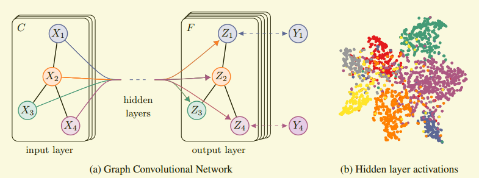
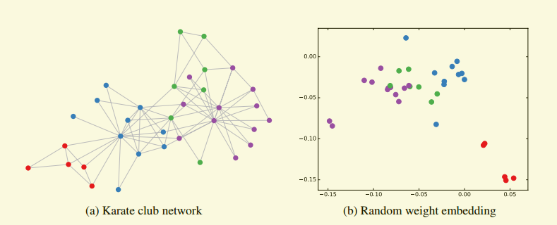
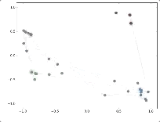

> [^1]: Kipf, Thomas N, and M. Welling. "Semi-Supervised Classification with Graph Convolutional Networks." (2016).

## GCN提出

GCN主要面对的是——图结构数据，这也是CNN、RNN无法解决或者效果不好的问题。

CNN主要是针对于图像识别，研究对象是二维的图片结构，CNN的核心在于kernel的设计，kernel是一个小窗口，在图片上平移，通过卷积运算提取特征。

CNN两个精髓所在是**平移不变性**和**参数共享**。一个小窗口无论移动到图片上哪一个位置，其内部的结构是一模一样的，实现参数共享。

RNN针对于自然语言这样的序列信息，是一个一维结构，通过各种门的操作，使得序列前后信息相互影响，从而很好地捕捉序列的特征。

维度概念是基于**欧式空间**（Euclidean space），在欧式空间内，数据结构很规则。

现实中有很多不规则的数据结构，典型的包括：图结构/拓扑结构（Topology structure）、知识图谱等。图结构可以认为是**无限维**的一种数据，没有平移不变性。每一个节点（node）周围结构可能都是独一无二的。GCN是处理这种数据的一种方法。

GCN实际上也是一个特征提取器，针对的对象是图数据。GCN从图数据中提取特征，进而可以利用这些特征对图数据进行节点分类（node classification）、图分类（graph classification）、边预测（link prediction）、图的嵌入表示（graph embedding）。

从本质上讲，GCN是**谱图卷积（spectral graph convolution）的局部一阶近似（localized first-order approximation）**。GCN的另一个特点是模型规模随着图的边的数量的增长而线性增长。总的来说，GCN可以用于对**局部**图结构与节点特征进行编码。

## symbol和术语说明

> $\mathcal{G = (V,E)}$表示一个图，$\mathcal{V,E}$分别表示相应节点集和边集，$\mathcal{(u,v) \in V}$表示图中的节点，$\mathcal{(u,v)\in E}$表示图中的边。
>
> $A$表示图的邻接矩阵（adjacency matrix）
>
> D表示图的度矩阵（degree matrix）
>
> L表示图的拉普拉斯矩阵（Laplacian matrix）,$\mathcal{L}$表示图的归一化拉普拉斯矩阵。

### 邻接矩阵

用于表示图中节点的连接情况的矩阵，该矩阵可以是二值型，也可以是带权值。对于N个节点的无向图来说，邻接矩阵是一个$N \times N$的实对称矩阵。

### 度矩阵

节点的度表示与该节点相连的边的数量。图的度矩阵即用于描述图中每个节点的度的矩阵，其中，$D_{i,i} \ 1 \le i \le N $表示节点$i$的度。度矩阵是一个对角矩阵，对于无向图而言，一般只使用入度矩阵或出度矩阵。

### 拉普拉斯矩阵

定义矩阵$L$，其元素为：
$$
L(u,v)= \cases{ d_v \ ,\quad  if \ \ u=v \\ -1, \quad if \ \ (u,v) \in \mathcal{E} }
$$


## GCN原理

假设有一批图数据，其中有$N$个节点（node），每一个节点都有自己的特征，这些节点的特征组成一个$N\times D$维的矩阵$X$。

各个节点之间的关系形成一个$N\times N$的矩阵$A$，称为邻接矩阵（adjacency matrix）

GCN是一个神经网络层，层与层之间的传播方式是：
$$
H^{(l+1)} = \sigma \left(\tilde{D}^{-\frac{1}{2}}\tilde{A} \tilde{D}^{-\frac{1}{2}}H^{(l)} W^{(l)} \right) \tag{1}
$$
其中：

$\tilde{A} = A + I_N$，是带附加自连接的无向图G的邻接矩阵（adjacency matrix），$I_N$是单位矩阵。

$\tilde{D}$是$\tilde{A}$的度矩阵（degree matrix），公式为：$\tilde{D}_{ii} = \sum j\tilde{A}_{ij}$

$W^{l}$是第$l$层的可训练的权矩阵

$H^{(l)}$是$l^{th}$层的特征，对于输入层而言，即$H^{(0)}=X$

$\sigma$是非线性激活函数，如$ReLU(·) = \max(0,·)$

> GCN的这一公式可以很好地提取图的特征，其中$\tilde{D}^{-\frac{1}{2}}\tilde{A} \tilde{D}^{-\frac{1}{2}}$是可以根据输入$A$提前计算好的

论文[^1]中给出的模型结构图如下:



GCN将输入的一个图，通过若干层GCN将每个node的特征从$X$变为$Z$，但无论中间有多少层，node之间的连接关系，即**$A$是共享**的。

> 假设构造一个两层的GCN，激活函数分别采用RELU和Softmax，则整体的正向传播公式为：
> $$
> Z= f(X,A)=\rm softmax \left(\hat{A}\  \rm ReLU\left(\hat{A} X W^{(0)}\right) W^{(1)} \right)
> $$
> 最后针对所有带标签的节点计算cross entropy损失函数：
> $$
> \mathcal{L}=-\sum\limits_{l \in \mathcal{Y}_L}\sum^{F}\limits_{f=1} Y_{lf} \ln Z_{lf}
> $$
> 这样可以训练一个node classification 模型，即使只有很少的node标签也可以训练，因此称之为**半监督分类**。

## GCN公式解释

针对于GCN公式的解释：

每一层GCN的输入都是邻接矩阵A和node的特征H，做一个内积，再乘以一个参数矩阵W，然后再用非线性激活函数$\sigma(·)$，如$ReLU$，就相当于一个简单的神经网络层：
$$
f\left(H^{(l)},A \right)=\sigma\left(AH^{(l)}W^{(l)} \right)
$$
这么简单的模型本身已经很强大了，但这个简单模型有几个局限性：

- 只使用A的话，由于A的对角线上都是0，所以在和特征矩阵H相乘时，只会计算一个node的所有邻居的特征的加权和，该node本身的特征会被忽略。因此，做了一个小小改动，给A加上一个单位矩阵I（identity matrix）。
- A是一个没有经过归一化的矩阵，与特征矩阵相乘会改变特征原本的分布，产生不可预测问题。因此，需要对A进行标准化处理。Normalizing $A$ such that all rows sum to one. 

首先让A的每一行加起来为1，操作如下：
$$
D^{-1}A ，\rm{ where\ D\ is\ the\ diagonal\ node\ degree\ matrix}
$$
拆开与A相乘，得到一个对称且归一化（symmetric normalization）的矩阵：
$$
D^{-1/2}AD^{-1/2}
$$
这样就不仅仅只是对邻居节点特征取平均值。最终得到GCN公式：
$$
f\left(H^{(l)},A\right) = \sigma \left(\tilde{D}^{-\frac{1}{2}}\tilde{A} \tilde{D}^{-\frac{1}{2}}H^{(l)} W^{(l)} \right)
\\ \rm{\\with\ \tilde{A} =A+I,\ where\ I\ is\ the\ identity\
 matrix\ and\\ \tilde{D}\ is\ the\ diagonal\ node\ degree\ matrix\ of\ \tilde{A}}
$$
其中：$D^{-1/2}AD^{-1/2}$与对称拉普拉斯矩阵十分类似，在谱图卷积的核心就是使用对称归一化拉普拉斯矩阵，这也是GCN的卷积叫法的来历。原文[^1]中给出完整的从谱图到GCN推导过程。

[论文作者关于GCN的说明博客](http://tkipf.github.io/graph-convolutional-networks/#fn2)

## GCN实验效果验证

GCN厉害的地方：即使不训练，完全使用随机初始化的权重参数W，特征提取就可以很优秀。而CNN不训练是根本得不到有效特征。

使用一个俱乐部会员的关系网络，使用随机初始化的GCN进行特征提取，得到各个node的embedding，已经在空间上自动聚类，可视化如下：

 

给少量的标注信息（文中仅仅一个标注样本）然后去训练，GCN的可视化效果如下：




备注：

（1）对于一些网络可能没有节点的特征，这也可以使用GCN，采用的方法是用单位矩阵I替换特征矩阵X。

（2）若没有任何的节点类别的标注，或者其他标注信息，也可以使用GCN，不用训练的GCN，也可以用来提取graph embedding，且有不错的效果

（3）GCN网络层数，论文作者在实验中发现，2-3层效果就很好


## 参考文章

### 一些博客

[图卷积神经网络入门详解](https://cloud.tencent.com/developer/article/1537129)

### 一些论文

```
https://jiangxj.top/document/papers_notes/pdf_files/GCN.pdf
```


