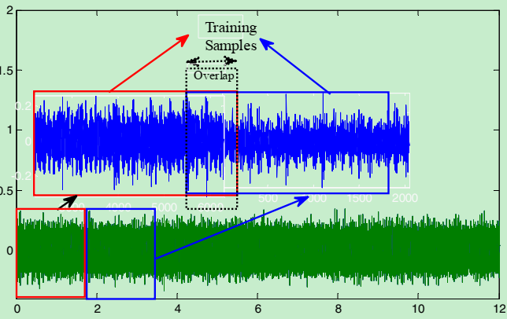

> Afrasiabi,S. et al. “**Real-Time Bearing Fault Diagnosis of Induction Motors with Accelerated DL Approach**”, *2019 10th International Pedstc*,2019.

## Abstract/研究思路

提出了一种加速和简化(compress)CNN的方法，应用到异步电机(induction motors)的轴承故障诊断**可以直接应用到原始数据(raw data)，highly accurate，non-time consuming，能应用到不同类型的机械部件，集特征提取(feature extraction)和检测(detection)，降低的传统的CNN的计算代价**。

使用了CWRU的轴承数据集，和conventional CNN(deep-based constructure)、SVM-ANN-LVQ(shallow-based constructure)进行性能对比。

## Introduction/研究背景

轴承故障诊断方法主要分为三种：model-based、signal-based、data-driven 

基于模型的方法直截了当，但必须是建立在模型参数和物理系数一对一的映射上。

基于信号的方法是基于时域信号(time-domain)的时域或频谱分析(spectral analysis)。但是具有很高的computation time以及频谱分析对噪声较为敏感。

数据驱动针对大量数据，且不需要先验的已知模型和参数。分为unsupervised learning model(without classification label，k-means，SOM)和 supervised learning model(LVQ，SVM)。

非监督学习：基于数据之间的相似性进行聚类，并与每个聚类中心进行一对一映射。每一个聚类中心的选择以及最优化是主要难点。

监督学习：对数据 进行分类标记，模型基于数据信息和冗余来学习模式和规则。监督学习可以分为基于浅层结构(shallow structure)（包括学习矢量量化(LVQ)、SVM）和深层结构。

浅层结构模型无法从原始数据中产生区分性特征，需要结合信号特征提取过程。无法成为异步电机轴承故障检测的一般解决方案，此外，会增加计算成本，对硬件要求较高。

深层结构(deep neural networks)结构能从原始数据中学习不变和复杂的特征，且无需任何其他特征提取。

近年来针对异步电机轴承故障诊断的方法主要有：DBN、CNN、RNN。其中CNN在分类问题中有出色的特征学习能力，但是由于CNN包含很多层，计算代价较高，复杂的结构也使得传统的CNN不适合处理real-time应用问题。


## 研究方法概述

>  步骤/流程图  数据处理分析

### 数据预处理

使用的CWRU的12kHz采样频率数据，每一个故障类型包含三种故障直径，0.007 inch，0.014 inch，0.021 inch，共分为10类。每一个轴承测试条件下有120000个振动原采样数据可用。

划分为训练和测试数据集，训练集数据交叠(overlap)【数据增强目的】。



所有的采样通过最小最大值归一化。

### 基础的CNN结构

卷积+池化+全连接层

**卷积**：负责提取局部特征，使用一个过滤器（卷积核）扫描整个输入数据集，从而划分了各个小区域，得到这些小区域的特征值。


$$
y_j^l = f \left(\sum\limits_{i=1}^{M_j}(y_i^{l-1} \otimes W_{ij}^l + b_j^l)\right)
$$
其中$y_j^l$是第$l$层的输出，$f(·)$是激活函数，$W_{ij}^l$是连接 第$l$层的第$i$个特征映射图和第$l-1$层的第$j$个特征映射图 的核权重，$b_j^l$是对应的偏置矩阵。激活函数使用的是ReLU。


**池化（下采样）**：数据降维，避免过拟合。是将特征图转化为相应的单个输出来降低特征图的分辨率。每一个单独的特征图(feature map)都要经过池化层。使用的是max-pooling，最大池化层输出较低分辨率的特征图，选择是领域最大值。


$$
y_{ij}^l = \max (y_{1_1 j_1}^l : i \le i_1 \le i+l_p,j \le j_1 \le j + W_p)
$$
其中，$l_p，W_p$是pooling window的长度和宽度。


**全连接层**：输出结果。利用全连接层提取特征映射并将其关联到故障诊断中。
$$
y_j^l =W_f · f \left(\sum\limits_{i=1}^{M_j}(y_i^{l-1} ·W_{ij}^l + B_j^l)\right)
$$
$W_f$和$B_j^l$分别是全连接层的权重和偏置。


**损失函数**：使用的是二进制交叉熵函数(binary-cross entropy function)。
$$
f_{bi-c}(r,P) = - \sum_k r_k \log (P_k)
$$
其中，$r_k=0$或1，表示是否是故障条件，$P_k$是从CNN模型得到的故障概率。


### 加速CNN/Accelerating CNN

为了降低CNN的计算代价和内存空间，通过修剪CNN结构和权重共享的方式对CNN网络结构进行优化处理。

> 深度学习的内存管理问题？

#### CNN修剪/CNN Pruning

删除冗余连接，保存信息连接。设置一个threshold，所有的权重低于这个阈值被删除，稀疏连接(sparse connections)剩余权重，重新训练网络。


#### 权重共享/Weigth Sharing

采用标量量化的权重共享，effective weight是有限的，将这些权重存储在有多个连接的网络中，以共享相同的权重。**在共享权重的时候调整减少权重。**

采用K-means方法识别每层的共享权重。使用簇内平方和(within-cluster sum of squares, WCSS)的方法增加共享权重的数量。

在聚类和fine tunning之后，通过线性初始化技术(linear initialization technique)来初始化共享权重。


### 实验验证

| fault location       | No fault | Ball | Inner race | Outer race |
| -------------------- | -------- | ---- | ---------- | ---------- |
| number of categories | 1        | 3    | 3          | 3          |
| Train-set size       | 1980     | 5940 | 5940       | 5940       |
| Test-set size        | 75       | 225  | 225        | 225        |

为验证模型的鲁棒性，在初始信号中加入了高斯白噪声，信噪比(SNR=4)。


> 为什么选择要加入高斯噪声？

分类的性能指标包括：accuracy(Acc)、specificity(Spe)、positive predictivity(Ppr)：
$$
Acc=\frac{TP+TN}{TP+TN+FP+FN}
$$

$$
Spe = \frac{TP}{TP+FN}
$$

$$
Ppr=\frac{TP}{TP+FP}
$$

其中，$TN$表示已检测故障的数量，$FP$表示没有检测到故障的数量，$TP$表示未诊断为故障的非故障条件的数量，$FN$是误诊断为故障的正常条件的数量。

基于keras package，作为对比，采用：

- 1025个输入神经元，一个有500神经元的隐含层，一个10个神经元节点的输出层的ANN
- 基于欧氏距离的LVQ，包含800个输入神经元，一个含有60个神经元的关联的隐含层
- 使用径向基函数和交叉验证的SVM
- 使用sigmoid函数的CNN，迭代1400 epoch


## 创新点

通过移除less important connection和权重共享来实现**实时的故障诊断**。

将特征提取和分类封装到一个block中，实现了比传统CNN快4倍的速度，以此实现实时的故障诊断。


## Critique

> 不足或值得研究的地方

故障诊断：寻找到更好的特征表达方法；寻找到最优的特征表达以及分类器的组合；制造出新的传感器(硬件上最优化)。

在小型的训练数据集上有没有更好的办法，训练网络结构，进行特征提取和分类？（迁移学习？）


为什么引入高斯白噪声来研究去噪？

> $$
> SNR_{dB}=10\log \left(\frac{P_{signal}}{P_{noise}}\right)
> $$
>
> 通常获取的信号是离散的，可以直接计算其功率，假设有一组离散信号$S=\{s_1,s_2,\dots s_n\}$，那么其信号功率$P_{signal}$为：
> $$
> P_{signal} = \frac{1}{n}\sum\limits_{k=1}^n s_k^2
> $$
> 假设信噪比$SNR=-2dB$，即可计算出噪声功率为：
> $$
> P_{noise} = \frac{P_{signal}}{10^{\frac{SNR}{10}}}
> $$
>
> ```python
> import numpy as np
> def gen_gaussian_noise(signal,SNR):
> """
> :param signal:原始信号
> :param SNR:信噪比
> :return:生成的噪声
> """
> 
> #通过numpy.random的randn生成一个标准高斯分布序列
> noise=np.random.randn(*signal.shape) # *signal.shape 获取样本序列尺寸，产生N(0，1)噪声，噪声采样频率和信号采样频率的校准
> noise=noise-np.mean(nosie)  #均值=0
> signal_power=(1/signal.shape[0])*np.sum(np.power(signal,2)) #信号功率/信号方差/标准差std**2
> noise_variance=signal_power/np.power(10,(SNR/10)) #噪声方差/噪声功率/噪声std**2
> 
> noise=(np.sqrt(noise_variance)/np.std(noise))*noise  #std*N(0,1)
> return noise
> 
> """
> def wgn(x,SNR): #wgn是获得原始信号为x相对于信噪比SNR dB的高斯噪声
> SNR = 10**(SNR/10.0)
> XPower = np.sum(x**2)/len(x)
> NPower = XPower / SNR
> return np.random.randn(len(x)) * np.sqrt(NPower)
> """
> ```
>
> ```python
> x=np.linsapce(1,6,2000) #1到6中，取2000个点
> signal=np.sin(x) #样本为正弦波形
> ```
>
> ```python
> noise=gen_gaussian_noise(signal,-2) #-2dB
> ```
>
> ```python
> noise_signal = signal+noise #合成含噪声样本，原始信号和噪声相加
> ```
>
> ```python
> def check_snr(signal,noise):
> 
> """
> :param signal:原始信号
> :param noise:生成的高斯噪声
> :return:返回两者的信噪比
> """
> signal_power=(1/signal.shape[0]) * np.sum(np.power(signal,2)) #0.5722037
> noise_power = (1/noise.shape[0]) * np.sum(np.power(noise, 2)) #0.90688
> SNR = 10 * np.log10(signal_power/noise_power)
> return SNR
> 
> SNR = check_snr(signal,noise)
> print(SNR)  #-1.99999999
> 
> ```

相对于真实噪声，使用人工合成噪声(synthetic noise)的好处是便于分析问题，设计算法，便于量化和评价算法结果。

使用高斯噪声的原因：在真实环境中，噪音往往不是由单一源头造成的，而是很多不同来源的噪音复合体，假设，把真实噪音看成很多不同概率分布的随机变量的组合，并且每一个随机变量都是独立的，根据中心极限定理，它们的标准范式会随着噪音音源的数量的上升，趋近于一个高斯分布。

基于上述假设，采用合成的高斯噪声是处理这种复杂，且又不知道噪音分布情况下，一个简单又有效的近似仿真。

深度学习是数据驱动的模型，其算法的设计并不强烈的依赖于噪声的概率分布，这对于降噪算法的泛化是很好的，但是深度学习算法一般是需要监督学习训练的，在训练数据集的选择上，又往往依赖于噪音的概率分布，如果需要做高斯去噪，训练数据应该添加高斯噪声，相对于传统方法，深度学习的在对特定噪声的处理的鲁棒性要更高。

[如何在信号中添加指定信噪比的高斯白噪声，为何深度学习中研究采用高斯白噪声](https://blog.csdn.net/u012995500/article/details/87606346)


