# Paper1_The Limitations of Deep Learning in Adversarial Settings

本文主要介绍了一种新的对抗样本攻击方法，利用输入特征到输出值之间的对抗性显著图，达到只需要修改少量的输入值即可误分类的目的，属于targeted攻击。

## 摘要

深度学习利用大型数据集和计算效率高的训练算法，在各种机器学习任务中胜过其他方法。然而，深层神经网络训练阶段的不完善使它们容易受到敌对样本的攻击:对手精心设计的输入，目的是造成深层神经网络分类错误。在此工作中，我们将针对深度神经网络(DNNs)的对手空间形式化，并在精确理解输入和输出之间映射关系的基础上，引入一类新的算法来构造对抗性样本。

## 简介

深度学习容易受到对抗样本的攻击，本文作者介绍了一种针对任何非循环前馈神经网络的攻击方法-**JSMA**(Jacobian Saliency Map)。该方法利用雅可比矩阵，计算从输入到输出的显著图，只需要修改一小部分的输入特征就能达到改变输出结构的目的。

文章首先对深度学习的攻击模型进行了详细的分类，包括攻击目标和攻击能力；接着详细介绍了雅可比显著图的攻击样本生成方法，主要利用了雅克比矩阵和显著图等概念；最后，通过在MNIST数据集上进行评估测试，不仅验证了攻击方法的成功，而且提出了一系列度量攻击难易程度的metrics，提出了可能的防御方法。

## 深度学习攻击模型的分类

论文详细介绍了深度学习系统攻击模型的目标与能力，并给出了相对应的参考文献。

### 攻击目标

深度学习应用系统中，模型的完整性(intergrity)非常重要，与模型的预测结果的准确性相关。深度学习的攻击模型主要攻击深度学习模型的完整性。具体来说，深度学习的攻击的就是努力找到一个输入样本$X^*$，从而导致分类结果出错。本文考虑以下四种影响模型完整性的攻击目标：

1. **Confidence Reduction:** 降低分类输出结果的置信度值，因此会引入分类歧义;
2. **Misclassification:** 将分类结果修改为除了原始标签外的其他任何标签值;
3. **Targeted Misclassification:** 产生输入，使得该输入的分类结果是一个特定的目标类;
4. **Source/Target Misclassification:** 针对一个原始样本和目标类，产生一个扰动量，使得当扰动量加到原始样本中，其分类结果是特定的目标类。

###  攻击能力

攻击者通常伴随着不同的攻击能力。对抗样本攻击发生在模型的预测阶段（非训练阶段，攻击时模型已经训练完成），根据攻击者的获得信息的不同，按照攻击能力的大体递减顺序，分为以下五类：

1. **Training Data & Network Architecture:** 这是最强的攻击，可以同时模拟网络的结构和分析训练集数据。
2. **Network Architecture:** 这种攻击了解深度学习网络结构及其参数，包括网络层数、激活函数、层间权重、偏差等。本文的攻击假设属于此类。
3. **Training Data:** 攻击者可以收集替代数据集，这些替代数据集可以从用于训练DNN的原始数据的分布中采样。一种典型的攻击方法是攻击者使用太呆数据集来训练深度学习网络，用来近似原始的深度学习网络结构。
4. **Oracle:** 攻击者可以把神经网络当作一个“Oracle”。攻击者可以通过提供输入样本得到对应的输出预测值。原则上，攻击者通过观察输入和输出间的区别，从而自适应地构造对抗样本。
5. **Samples:** 攻击者可以有能力收集神经网络分类器的输入和对应的输出，但不同的是，攻击者不能通过修改输入来观察输出的差异。这是最差的攻击能力。

## JSMA攻击方法

本文针对的是非循环前馈(acyclic feedforward)DNN网络，设计的一种新的基于雅可比显著图(Jacobian Saliency Map)的攻击样本生成方法。该方法需要计算前向导数，以便于构建一个**对抗性显著图**，从而确定输入特征子空间与攻击目标之间的关联性。通过这种方法扰动输入空间的特征值，可以很快达到使得攻击者误分类的目的。

### 直观理解

假设考虑一个简单的一层神经网络，通过在训练集上训练，得到布尔AND函数，即输入样本$X=\{x_1,x_2\}$，输出为$F(X) = x_1 ∩ x_2$。当输入样本$X \in [0,1]^2$时，整个神经网络学习得到的函数$F$如下左图所示，输入值在0（蓝色）和1（黄色）之间有非常明显的断层。

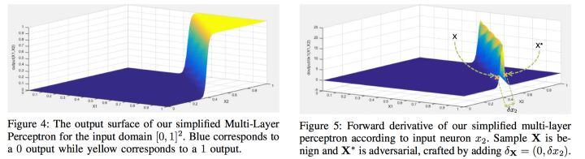

进一步计算函数$F$对输入值每个特征$\{x_1,x_2\}$的前向导数，即为：

$J_F(X) = \left [ \frac{\partial F(X)}{\partial x_1},\frac{\partial F(X)}{\partial x_2}\right]$

前向倒数的示意图如上右图所示。直观上，前向导数越大的地方越容易构建对抗样本。如右图中$X=(1,0.37)$和$X^* =(1,0.43)$两点。距离非常近$\delta_{x_2} = 0.05$，但是两者在神经网络函数的输出完全不同。

由此可以看出：

- 输入值极小的扰动可以致使神经网络输出的不同；
- 输入域不同region中找到对抗样本的难易程度不同；
- 前向导数可以减少对抗样本的搜索范围。

### 推广到一般的神经网络

限定在非循环的DNN，且其中每个激活函数都是可微分的。构造对抗样本的伪代码：

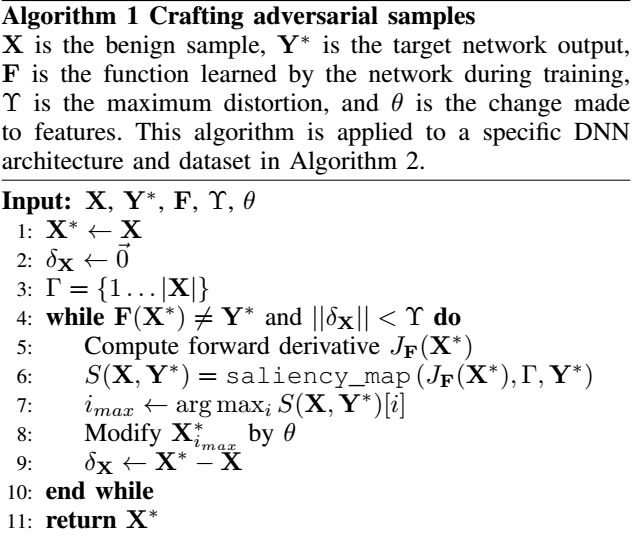

构造算法的输入分别是：

正常样本$X$，目标标签$Y^{*}$，非循环DNN输出$F$，最大的扰动量参数为$\gamma$，特征变量参数$\theta$。

算法返回值为对抗样本$X^{*}$。

算法的主要步骤如下：

1. 计算前向导数$J_F(X^{*})$
2. 基于前向导数构造显著图$S$
3. 利用参数$\theta$修改输入特征$i_{max}$

详细步骤如下：

**step1.计算DNN的前向导数**

计算公式为：

$\frac{\partial F_j(X)}{\partial x_i} = \left( W_{n+1,j}· \frac{\partial H_n}{\partial x_i}\right) \times \frac{f_{n+1,j}}{\partial x_i} (W_{n+1,j} ·H_n +b_{n+1,j})$

其中$\frac{\partial H_n}{\partial x_i}$可以通过递归方式求解，其余参数已知。因此对于深度学习模型$F$和给定输入$X$而言，前向导数矩阵为：

$J_F(x) = \frac{\partial F(X)}{\partial X} = \left[\frac{\partial F_j(X)}{\partial x_i} \right]_{i \in 1,\dots,M;j \in 1,\dots,N}$

**step2.计算对抗性显著图**

用来表示输入空间中哪些特征对输出结构影响最大。为了达到将对抗样本分为$t$类的目的，$F_t(X)$的概率必须不断增大，且当$j \neq t$时，$F_j(X)$应该不断减小，直到
$$
t= \rm arg \ \max_j F_j(X)
$$
文章给出了一种显著图的计算方式：
```tex
\begin{equation}
S(X,t)[i]=
\begin{cases}
0: \rm if \ \frac{\partial F_t(X)}{\partial X_i}<0 \ \rm or\ \sum\limits_{j\neq t}\frac{\partial F_j(X)}{\partial X_i}>0\\
\left(\frac{\partial F_t(X)}{\partial X_i}\right)\left| \sum\limits_{j\neq t} \frac{\partial F_j(X)}{\partial X_i}\right|: \mbox{otherwise}
\end{cases}
\end{equation}
```

其中$i$表示输入空间的第$i$个特征，$J_{ij}(x)$表示前向导数矩阵的元素。通过计算显著图，显著图数值$ S(X,t)[i]$ 越大，表示会增加分类器将其分为对应target类的概率或者减少分类为其他类别的概率。

**step3.样本修改**

通过对抗性显著图的确定需要修改的输入特征后，对应的特征(像素点)修改值，文章引入参数$\theta$表示输入特征的修改量。在MNIST实验中，参数$\theta = +1$。

## MNIST数据集上的实验结果

实验主要从三方面评估JSMA攻击方法的效果:

- 是否可以利用JSMA攻击任何样本？
- 如何确定样本被攻击的难易程度?
- 与DNN相比，人类是否可以正确认知JSMA攻击样本？

问题一：

作者分别从MNIST数据中training、validation和Testing数据中选择10000个样本，每个样本产生对应的9个targeted对抗样本，从而总共产生270000个对抗样本。实验结果如下图所示：

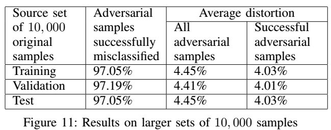

实验表明，JSMA攻击对任何样本能够以97%以上的成功概率产生对抗样本，并且修改的输入特征平均百分比在4%左右。意味着，一个样本784个像素中平均只要32个像素点被修改就能达到生成对抗样本的目的。

问题二：

作者定义了Hardness measure $H(source,target)$来度量原类别source被扰动成target类的难易程度；定义Adversarial distance $A(X,target)$表示样本X到类别 target之间的距离，A距离越大表示越难将X误分类成target类。

问题三：

作者利用Mechanical Turk在线众包系统，分析人类判断JSMA对抗样本的结果。试验发现，人类不能发现无法发现JSMA对抗样本中添加的扰动，也就是满足了对抗样本“被DNN误分类，但是能被人类正确分类”的第二个条件。

[原文链接](/download/The Limitations of Deep Learning_in Adversarial Settings.pdf)

------

# Paper2_Explaining and harnessing adversarial examples

这篇文章主要提出与之前论文不同的线性假设来解释对抗样本的存在性。同时，论文提出了一种简单的对抗样本生成方法-FGSM，并且再利用该攻击方法产生的对抗样本进行对抗训练。这篇文章主要说明的对抗样本的三个方面：1.存在性、2.攻击方法、3.防御方法。

## 摘要

一些机器学习模型，包括神经网络，总是对来自数据集的反例输入进行错误的分类，这些反例输入是通过对数据集中的示例应用小的但有意为之的最坏情况的扰动而形成的，这样，扰动的输入导致模型以很高的可信度输出错误的答案。早期对这一现象的解释主要集中在非线性和过拟合上。相反，我们认为神经网络易受对抗性扰动的主要原因是它们的**线性特性**。

这种解释得到了新的定量结果的支持，同时给出了关于它们最有趣的事实的第一个解释:它们在体系结构和训练集之间的泛化。此外，该视图提供了一种生成对抗性示例的简单而快速的方法。利用该方法为对抗训练提供了实例，减少了MNIST数据集上maxout网络的测试集误差。

## 介绍

当前机器学习已经被广泛应用在日常生活各个领域，但是Szegedy等人于2014年首先发现当前的机器学习模型包括神经网络等模型容易受到对抗样本(Adversarial Examples)的攻击。所谓对抗样本，即攻击者通过轻微地扰动正常样本产生对抗样本，在且保证该攻击不影响人眼的识别的情况下，达到误导分类器的目的。

在当前的研究中，对抗样本的原因产生的原因仍是一个谜。之前很多假设推测对抗样本的产生是因为深度神经网络的极度非线性，可能还结合了监督学习中正则化和模型均化不足等原因。但是本文的作者认为，这种非线性(Nonlinear)的推测解释没有必要，高维空间的线性(Linear Behavior)足够产生对抗样本。根据这个观点，作者设计了一种新的快速产生对抗样本的方法，并且使得对抗学习(Adversarial Training)更实用。这种对抗学习方法提供除了传统正则化方法(dropout, pre-training, model averaging等)外另外一种"正则化方法"。

## 对抗样本的线性解释

因为样本输入特征(input feature)的精度有限(一般图像的每个像素是8bits, 样本中所有低于1/255的信息都会被丢弃)，所以当样本 $x$ 中每个元素值添加的扰动值 $\eta$ 小于样本输入特征精度时，分类器无法将样本$ x$ 和对抗样本 $\tilde{x} = x + \eta$ 区分开。也就是对一个分类良好的分类器而言，如果$ \epsilon $是一个足够小以至于被舍弃掉的值，那么只要$ ||\eta||_{\infty} < \epsilon$ ，分类器将认为 $x$ 和$ \tilde{x} $属于同一个类。

下面考虑权重向量$ \omega^{T} $和对抗样本 $\tilde{x} $的点积为$\omega^{T}\tilde{x} =\omega^{T}(x +\eta) = \omega^{T}x + \omega^{T}\eta$。可以看出，对抗扰动使得activation增加了 $ \omega^{T}\eta$，作者提出让$ \eta = sign(\omega) $从而使$  \omega^{T}\eta$ 最大化。假设权重向量 $\omega$有$ n $个维度，且权重向量中元素的平均量值是$ m$，那么activation将增加$\epsilon_{ m n} (\Rightarrow\omega^{T}\eta \le n\times m \times \epsilon )$。虽然$||\eta||_{\infty} $不会随着维度$n$的变化而变化，但是由$\eta$导致的activation的增加量$\epsilon_{ m n}$会随着维度$n$线性增长。那么对于一个高维度的问题，一个样本中大量维度的无限小的干扰加在一起就可以对输出造成很大的变化。

所以对抗样本的线性解释表明，对线性模型而言，如果其输入样本有足够大的维度，那么线性模型也容易受到对抗样本的攻击。

## 非线性模型的线性扰动

作者利用对抗样本的线性解释提出了一个快速产生对抗样本的方式，也即Fast Gradient Sign Method(**FGSM**)方法。

假设模型的参数值为$\theta$，模型的输入是$ x， y $是模型对应的label值， $J(\theta,x,y)$是训练神经网络的损失函数。对某个特定的模型参数 $\theta$ 而言，FGSM方法将损失函数近似线性化，从而获得保证无穷范数限制的最优的扰动(即$||\eta||_{\infty} < \epsilon$ )，扰动值具体为：

$ \eta = \epsilon · \rm sgn(\nabla_xJ(\theta,x,y))$

FGSM攻击算法在ImageNet数据上的展示如下图所示：

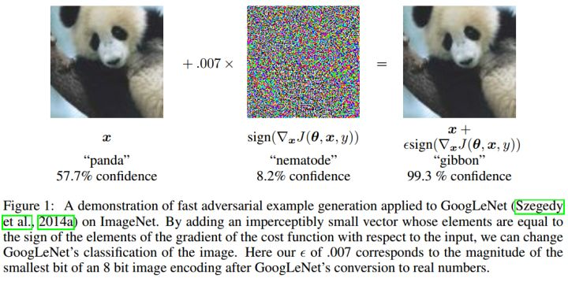

实验表明：

FGSM这种简单的算法确实可以产生误分类的对抗样本，从而证明了作者假设的对抗样本的产生原因是由于模型的线性特性。同时，这种算法也可作为一种加速对抗训练的方法。

## 线性模型的对抗训练

考虑最简单的逻辑回归模型上运用FGSM方法，理解如何在一个简单的设置中生成对抗样本。

假设要训练一个逻辑回归的模型来识别标签$y \in \{-1,1\}$，预测函数为：

$P(y=1) = \sigma(w^Tx+b)$

即：$P(y=-1) = 1-\sigma(w^Tx+b)$。其中$\sigma$表示sigmoid函数。样本的损失函数为：

$\mathbb{E}_{x,y \sim p_{data}} \varsigma(-y(w^Tx+b))$

其中：$\varsigma(z) = \log (1+\exp(z))$是softplus函数。

对该模型使用FSGM方法，扰动量为：

$\eta = \epsilon· \rm sgn(\nabla_xJ(\theta,x,y))\\ 
 = \epsilon· \rm sgn(\nabla_x\varsigma(-y(w^Tx+b)))\\
 = \epsilon · \rm sgn(-w^T * \sigma(-(w^Tx+b))) \\
 = \epsilon · \rm sgn(-w) \\
 = - \epsilon · \rm sgn(w)$

且$\rm w ^T \rm sgn(w) = ||w||_1$。逻辑回归的对抗形式为：

$\mathbb{E}_{x,y \sim p_{data}} \varsigma(-y(w^T\tilde{x}+b)) = \mathbb{E}_{x,y \sim p_{data}} \varsigma(y(\epsilon||w||_1-w^Tx-b))$

其中：

$\tilde{x} = x+ \eta$ 

$\eta = \epsilon -sgn(w)$

## 深度网络的对抗训练

相比于线性模型，深度网络至少可以在训练网络过程中来抵御对抗扰动攻击。文章给一种利用FGSM进行对抗训练的方法：

$\tilde{J}(\theta,x,y) = \alpha J(\theta,x,y)+(1-\alpha)J(\theta,x+\epsilon\ \rm sign(\nabla_xJ(\theta,x,y)))$

这种对抗训练的方法意味着在训练过程中不断更新对抗样本，从而使得当前模型可以抵御对抗样本。但是作者表示在训练集上对抗训练的错误率error rate没有达到过0%，作者主要从以下两个方面解决：

- 增大模型，即使用1600个unit代替240个unit
- 在validation set上也使用early stopping算法

文章表明，在不进行对抗训练的情况下，模型识别FGSM攻击方法生成样本的错误率是89.4%，但是通过对抗训练，同样的模型识别对抗样本的错误率下降到17.9%。

## 对抗样本泛化原因

对抗样本具有Transferability。具体来说，在一个特定模型上产生的对抗样本通常也容易被其他模型误分类，即使这些模型的结构不同或者模型在不同的训练集上训练。甚至，不同的模型对对抗样本误分类的结果相同！作者表明，非线性或者过拟合的假设不能解释上述的现象，即， 为什么拥有无限能力的极度非线性模型会以相同的方式标注数据分布点？

在本文提出的线性解释下，作者认为对抗样本在广泛的子空间存在。

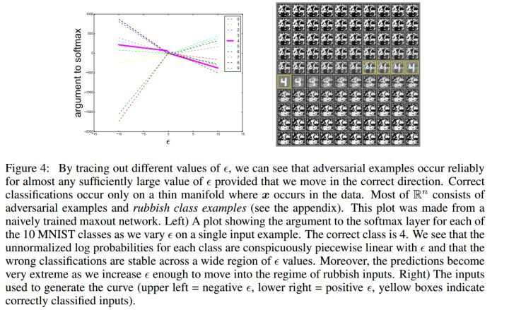

上图表明，在不同的 $\epsilon$ 下，可以看到FGSM可以**在一维的连续子空间内产生对抗样本，而不是特定的区域**。这就解释了为什么对抗样本特别多，以及对抗样本transferability存在的原因。

另外，为了解释为什么不同的分类器将对抗样本误分类到同一个类，作者假设目前的方法训练神经网络都类似于在同一个训练集上学习的线性分类器。由于机器学习算法的泛化能力，所以线性分类器可以在训练集的不同子集上训练出大致相同的分类权重。底层分类权重的稳定性反过来又会导致对抗样本中的稳定性。

## 对抗样本存在性的其他假设

这一部分，作者通过实验及分析，反驳了其他两种对抗样本存在性的假设。

假设1：生成训练可以在训练过程中提供更多的限制，或者是的模型学习如何分辨"real"或者"fake"的数据，并且对"real"的数据更加自信。

文章表明，某些生成训练并不能达到假设的效果，但是不否认可能有其他形式的生成模型可以抵御攻击，但是确定的是生成训练的本身并不足够。

假设2：对抗样本存在于单个奇怪的模型(models with strange quirks)，因此多个模型的平均可以使得模型防御性更好。

文章通过实验说明，模型融合对于对抗样本的防御能力非常有限。

[原文链接](/download/Explaining and Harnessing Adversarial Examples.pdf)

------

# Paper3_Practical Black-Box Attacks Against Machine Learning

本文提供了一个生成对抗样本的黑箱攻击方式，以前的对抗样本的生成是基于白盒的，即攻击必须要知道受攻击的模型的详细信息（包括模型结构参数，训练样本集等），但在实际应用中，这种理想的条件是几乎不存在的，攻击者几乎不可能的到模型的详细信息。本文不需要知道这些信息，只需要可以接触到受攻击模型的判别label即可完成对抗攻击。论文的作者提出了一种基于黑盒攻击的方式，训练一个跟想要攻击的目标模型完成同样任务的替代模型，基于当前的模型去生成对抗样本，这些对抗样本最终被用于攻击原目标模型。

## 摘要

机器学习模型，如DNNs，很容易受到反面例子的攻击：恶意的输入被修改以产生错误的输出，而在人类观察者看来没有被修改。潜在的攻击包括恶意软件等恶意内容识别为合法或控制车辆的问题。

现在所有描述对抗示例攻击都需要了解内部模式或其训练数据。我们将介绍攻击者在不了解此类知识的情况下控制远程托管的DNN的第一个实际演示。实际上，我们的黑盒对手的唯一能力是观察DNN给所选输入的标签。我们的攻击策略包括训练一个局部模型来代替目标DNN，使用由目标DNN综合生成并标记的输入。我们使用局部替代的方法来构造对抗性的例子，发现它们被目标DNN错误分类。

为了执行一个真实的、完全盲的评估，我们攻击了一个由MetaMind(一个在线深度学习API)托管的DNN。我们发现，他们的DNN错误分类了84.24%的与我们的替代品制作的对抗性的例子。我们使用逻辑回归替代方法对Amazon和谷歌承载的模型进行相同的攻击，从而演示了我们的策略对许多ML技术的一般适用性。

## 攻击限制

在不知道受攻击模型的网络结构，参数设置以及训练样本的情况下，来生成对抗样本使得受攻击的模型误判。

以往大多数的方法是针对模型，猜测探索模型的误判方向，找到更容易产生偏差的方向，在这个方向上做扰动，从而达到迷惑模型的目的。现在除了知道接受到的输入打的标签，无法基于梯度的方法，有针对的探索模型特性。

## 基本思路

无法接触到受攻击模型的信息，采用生成替代模型，来模拟近似受攻击模型的某些决策边界。替代模型不是用来学习判别最优的，而是学习能够模仿受攻击模型的决策边界的替代能力。

### 替代模型训练

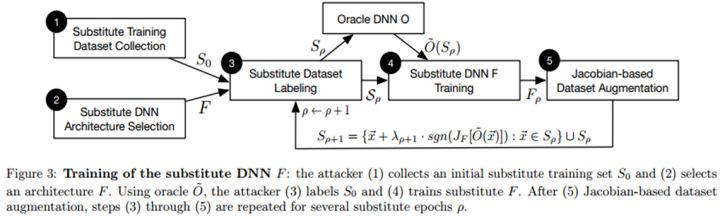

训练一个替代模型$F$来近似原始模型oracle O。存在以下问题：

- 在不知道原始模型的结构信息的条件下为替代模型选择结构
- 为了保证这个方法容易处理，需要限制向原始模型询问(输入输出)的次数，因为全部遍历真实输入是不可能的，query太多容易被封。

作者给出一种**合成数据生成技术**(synthetic data generation technique)，这个方法是基于雅可比行列式对数据集进行扩充。

### 样本合成

Jacobian-Based Dataset Augmentation:

雅可比矩阵$\frac{\partial F(x,\theta)}{\partial x}$描述了输出$F$对输入$x$的敏感程度，即很小的输入会导致很大的输出值变化幅度。这些方向上，更能描述模型的分类边界的样本情况。如下图，梯度和边界样本：

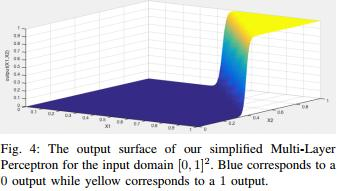

根据前面的一批合成样本，来生成后续的样本集，想要更有效的合成数据集，就要强化这些方向上的数据合成（即基于雅可比矩阵的数据集合成）。

新样本合成如下：

$S: = \{x+ \lambda · \ sgn(J_F[\tilde{O}(\vec{x})]):\vec{x} \in S_{\rho}\} \cup S_{\rho}$

其中：$\tilde{O}(\vec{x})$表示$x$在受攻击模型下的label，$J_F= \frac{\partial F}{\partial x_i}$。$\lambda$是扩充的参数，定义由雅可比矩阵确定的方向上采取的步长大小。

合成新数据多少条，就要query多少次受攻击模型。

利用合成数据训练替代模型，学习到原始模型的决策边界，然后利用已经学习了分类边界识别能力的模型做迁移对抗。

整个训练流程如下：

**Initial Collection 收集输入数据:** 攻击者收集代表输入域（input domain）的非常小的集合S_0。例如，原始模型用于分类手写体数字，则攻击者对从0-9的每个数字收集10张图片，并且，这个集合的分布不必与目标模型的训练集分布一致。

**Architecture Selection 选择模型的结构:** 为替代模型F选择一个结构。值得一提的是，模型的类型，层数，大小对攻击的成功与否影响很小。（当然前提是替代模型是work的，总不能说拿一个准确率30%的模型去替代一个准确率95%的模型）

**Substitute Training 训练替代模型:** 迭代的去训练替代模型F_ρ来提高其准确率（**ρ是迭代轮数**）

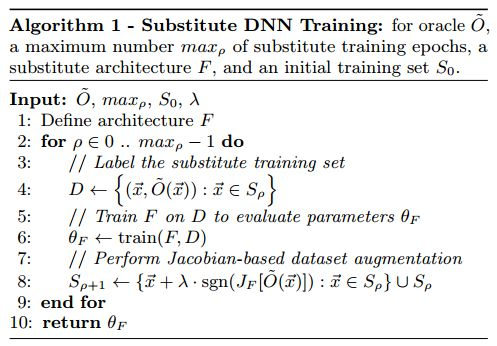

- Labeling 标数据：将初始的替代输入集合Sρ输入到模型O中，并将输出的结果作为样本的标签
- Training 训练模型F：用打好标签的替代训练集训练模型F_ρ
- Augmentation 数据集扩充：用之前提到的数据集扩充技术对当前的数据集$S_ρ$进行扩充，得到$S_ρ+1$，这个新的集合能够更好的代表模型的决策边界。用集合S_ρ+1重复上述的Labeling和Training过程。

整个过程被重复多次，以提高$F$的准确率并让其决策边界和模型$O$更相似。

## 对抗样本生成

根据正常的样本$x$生成对抗样本$x^{*}$，使得模型误判$F(x^{*}) = y^{*} \neq y$

对抗生成方法很多，大多数是基于梯度的，本文作者提及了两种方法。

（1）GoodFellow方法(Fast Gradient Sign Method)

$\delta_x = \epsilon·sgn\left[ \frac{\partial Cost(F,x,y)}{\partial x}\right] \rightarrow x^{*} = x+ \delta_x$

主要想法是：代价函数在输入的某方向上变化率很大，那么也是最容易使得代价变化的方向，代价函数是用来指导优化的(这是以正确率为目标的)，也即是最容易使得误判发生。

（2）Papernot方法：适合指定误导类别的对抗生成

将样本$x$误导为类别:
$$
t= \rm arg \ \max_j F_j(X),t \neq label(x)
$$
定义显著图（saliency map）：
$$
\begin{equation}
S(X,t)[i]=
\begin{cases}
0: \rm if \ \frac{\partial F_t(X)}{\partial X_i}<0 \ \rm or\ \sum\limits_{j\neq t}\frac{\partial F_j(X)}{\partial X_i}>0\\
\left(\frac{\partial F_t(X)}{\partial X_i}\right)\left| \sum\limits_{j\neq t} \frac{\partial F_j(X)}{\partial X_i}\right|: \mbox{otherwise}
\end{cases}
\end{equation}
$$
选择$\frac{\partial F_t(X)}{\partial X_i}<0 \ \rm or\ \sum\limits_{j\neq t}\frac{\partial F_j(X)}{\partial X_i}>0$的输入维度，做扰动更新来生成对抗样本。

主要想法是：雅可比矩阵$\frac{\partial F(x,\theta)}{\partial x}$表明了函数$F(x,\theta)$对$x$的敏感度，其绝对值越大的点，越更可能是分类的临界点，因此，根据雅可比矩阵值，可以缩小查找输入扰动有效点的范围。

这两种方法：GoodFellow的算法生成快速但是干扰大，易被发现；Papernot算法干扰小但是计算代价大。在该论文中选择了选择FGSM（即Goodfellow et al. algorithm）。

## 黑盒攻击MetaMind

作者在MetaMind网站上注册了改模型的API并上传了MNIST的50,000个样本作为训练集。作者强调整个过程都是自动的，他们无法得到训练的算法，模型结构和参数。

在实验的过程中，作者选取了两组替代训练集：

- MNIST subset: 作者在MNIST数据集中选取了150个样本，并且这些样本和输入到MetaMind中的样本都不一样。

- Handcrafted set: 为了保证结果不是因为替代模型的训练样本和原始模型的训练样本很相似，作者还手工制作了另一组初始替代训练集——用笔记本触控板手工制作了100个样本（数字有10个样本）。 然后，将它们调整为28x28灰度像素的MNIST格式。 一些样本如下所示：

  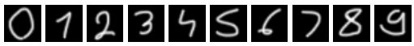

模型$F$的训练结果：

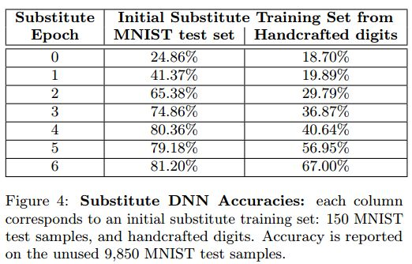

经过6轮训练，两个模型分别在MNIST数据集和Handcraft数据集上使得原始模型错误分类的成功率达到了81.2%和67%。

在不同的$\epsilon$参数【FSGM方法，扰动量为：$ \eta = \epsilon· \rm sgn(\nabla_xJ(\theta,x,y))$】下，基于两个替代模型生成的对抗样本让原始模型错误分类的成功率和对抗样本的可移植性如下图所示：


[原文链接](/download/Practical Black-Box Attacks against Machine Learning.pdf)

------

# Paper4_A Two-Pronged Defense against Adversarial Examples

人工智能逐渐成为攻击者的目标。其中非常重要的一类攻击称为“**对抗型攻击”**，即攻击者通过精心地轻微扰动正常样本产生**对抗样本**，该攻击样本并不影响人眼识别，但是却可以导致学习系统的误分类，从而达到攻击深度学习系统的目的。在本文中，作者总结了当前针对神经网络分类的攻击与防御方法，发现当前防御方法都依赖对抗样本或者对抗样本的生成过程，泛化能力非常差。针对这一问题，文章提出了一种与攻击无关的（attack-independent）的防御框架，不依赖于对抗样本及其生成过程，而仅仅利用数据本身的特征。

## 深度学习中的“对抗样本”

深度学习是当前最热的一个研究方向，在很多领域都表现出非常好的效果，比如图像识别、自然语言处理，自动驾驶，人机交互等。但是，当前很多研究研究表明，通过向深度学习系统中输入精心构造的数据，很容易达到攻击的目的。具体来说，攻击者通过精心地轻微扰动正常样本产生**对抗样本**，该攻击样本并不影响人眼识别，但是却可以导致学习系统的误分类，从而达到攻击深度学习系统的目的。

**对抗样本 V.S. 正常样本**

**正常样本**

对分类任务来说，正常样本$x$是“**自然出现的**”样本。也就是说，分类任务的物理过程是以不可忽略不计的概率生成正常样本$x$。

> **不可忽略不计**(non-negligible)对应的是**可忽略不计**(negligible) ；
> **可忽略不计**的意义: 一个以可忽略不计的概率发生的事件几乎不可能发生，即使将这个实验重复进行多项式次数。

举例来说，如果分类任务针对的是手写数字，那么数据的生成过程几乎不可能生成老虎的图像。

**对抗样本**

对分类任务来说，对抗样本$y$是"**非自然出现的**"样本，并且分类器对样本$y$的判断结果不同于一般人的判断。

接下来，作者正式形式化地定义了对抗样本、防御方法及其评估标准。


**形式化定义： 对抗样本、防御方法及其评估标准**

首先定义如下集合：

$S$: 样本空间内所有样本的集合;

$C_t$: 对分类任务$t$的互斥类别的集合，例如如果$t$是手写字体分类模型，那么:

$C=\{0,1,2,\dots,9\}$

$N_t$:$N_t = \{x| x \in S 并且x是针对分类任务t的自然产生的\}$

每个分类任务$t$都假定有一个数据产生过程，该过程中每个样本$x \in S$都是以概率函数$p(x)$生成的。如果该概率函数$p(x)$是不可忽略不计的(non-negaligible)，那么生成的$x$则是在分类任务$t$下自然产生的。通常研究认为：$N_t$构建的manifold的维度远远低于$S$。这是因为我们无法知道数据的真实生成过程，所以通常对$t$的自然数据集的联合来近似表示$N_t$。比如应用在图像识别的CIFAR和MNIST数据集。

**定义1:** 分类任务$t$的一个分类器表示为函数 $f_t: S  \rightarrow  C_t$;

**定义2:** 分类任务$t$的ground-truth分类器，表示的是一般人的判断标准。该ground-truth分类器可以表示为函数$g_t: S \rightarrow C_t \cup \{ \bot\} $，其中$\{\bot\}$对输入$x$的不同于任务$t$数据生成过程的其它分类判定，换言之，$\{\bot\}$表示针对对抗样本的分类判定结果。

**定义3:** 对分类任务$t$和分类器$f_t$而言的一个对抗样本$x$需要满足以下两个条件：

（1）$f_t(x) \neq g_t(x)$

（2）$x \in S/N_t$差集

> 第一个条件表明，对对抗样本来说分类器的判断结果通常会出错。但这个并非唯一原因，因为任何的分类器都不是完美的，分类器对正常样本也会产生误差；
> 第二个条件将对抗样本限定为仅仅由攻击者人为产生的用来欺骗分类器的样本。

**定义4:** 针对分类器$f_t$中对抗样本的防御方法可以表示为函数$d_{f_t}: S \rightarrow C_t \cup\{\bot\}$

那么，如何评估防御方法的效果呢？防御的目标是**用来提升分类器在对抗样本上而非正常样本上的准确率**。根据该想法，作者提出如下评估标准。

**定义5:** 如果以下任意一种情况满足，则表明防御方法$d_{f_t}$对样本$x$做出正确判断:

(1) 当$x$是正常样本时，$d_{f_t}$于ground-truth分类器$g_t$的判断结果一致，即对任意$x \in N_t$，有$d_{f_t}(x) = g_t(x)$;

(2) 当$x$是对抗样本时，或者有$d_{f_t}$直接判断$x$为对抗样本，或者$d_{f_t}$于$g_t$的判断结果一致，即对任意$x\in S/N_t$，有$d_{f_t} = \{\bot\}$或者$d_{f_t}(x) = g_t(x)$。

## 深度学习的攻击与防御

在本文中，作者主要总结了神经网络分类方法的攻击方法，即寻找符合条件且最合适的“对抗样本”，并且表明，所有的攻击最终都转化为优化问题的求解。


**常见攻击类型：产生对抗样本的方法**

**攻击类型1: Fast gradient sign method (FGSM)**

对抗样本$x'$采用迭代求解方法：$x'=x+ \epsilon·sgn(\nabla_x Loss(x,l_x))$，其中$Loss(x,l_x)$函数表示将样本$x$分类成$l_x$的代价，并将其代价最大化。

**攻击类型2: Iterative gradient sign method**

该攻击是对FGSM攻击的改进，确保每一步更新的图像与原图像的距离在$\epsilon $范围内，可以增加FGSM的攻击成功率，即：

$x_{i+1}' = clip_{\epsilon ,x}(x_i' + \alpha ·sgn((\nabla_x Loss(x,l_x)))$。

**攻击类型3: DeepFool**

该攻击的基本思路是：在图像空间中，找到距离正常样本$x$最接近的决策边界，然后跨过该边界去欺骗分类器，通常使用线性迭代的优化方法。

**攻击类型4: Carlini Attack**

该攻击是**当前最有效且最小扰动的**产生对抗样本的方法，可以用如下优化问题来表示:

$\min\limits_{\delta} ||\delta||_2 + c \cdot f( x + \delta), 使得 x + \delta \in [0,1]^n$


**防御方法总结**

作者根据当前常见的针对对抗样本的防御方法，总结了如下**三种常见的防御方法**。

**防御方法1: Adversarial training 对抗训练**

一个非常直接的想法是在训练过程中包含对抗样本的信息，从而构建一个鲁棒性更好的分类器，该方法即称为**对抗训练方法**。该方法直观上有效，但是有个非常严重的问题是，对抗训练很难推断出攻击者的攻击方式，即对抗训练无法得知攻击者产生的对抗样本的模式、每种对抗样本的比重，从而很难在对抗训练中使用。

**防御方法2: Detecting adversarial example**

该方法主要是训练一个分类器来区分对抗样本与正常样本，与对抗训练方法不同的是：对抗训练只是改善了原有分类器的正确性，而该方法是额外增加一个分类器。

**防御方法3: Defensive distillation**

该方法在训练过程中通过各种方式隐藏梯度信息，从而使得攻击很难通过梯度求解方法攻击目标训练器，但是该防御方法很容易被各种攻击技巧绕过。

然而这些防御方法都有**局限性**。方法1和方法2都需要对抗样本来训练防御方法，因此这些防御方法都是特定于产生这些对抗样本的过程，而对其他对抗样本不具有泛化能力；于方法3而言，Carlini等人表明distillation 方法并不能增加神经网络的鲁棒性，而且这种防御方法需要改变并重新训练目标分类器，增加了工程上的复杂性。


**“对抗样本”及本文的解决思路**

**误分类的原因 ——** 根据深度学习的流形假设(Manifold Hypothesis)，对大多数的AI任务来说，样本空间是一个非常高维的空间，但是我们所能掌握的有效样本其实在一个维度远远低于高维度样本空间的一个流行(Manifold)空间内。

因此，作者总结了一个**分类器错分类对抗样本**的原因，有如下两条：

1. 对抗样本远远地远离该任务的流行Manifold的边界。比如说，如果该任务是手写数字图像分类，那么不含有数字的其他图像都是对抗样本。因为分类器必须要对该图像分类，从而产生一个类标签，所以一定会导致错误分类；
2. 对抗样本非常接近于该任务的流行边界，如果此时该分类方法的泛化能力不好，那么也会发生误分类。

**本文的解决思路 ——** 本文中，作者设计实现了一个双管齐下的防御系统，针对上面两个误分类的原因，提出了对应的Detector和Reformer方法。针对第一个原因，Detector用来判断一个样本是否远远远离Manifold边界，如果是的话直接删除；接着针对第二个原因，对于一个样例，努力找到一个接近或者就在该任务Manifold之上的样例，其中是的近似表示，然后再交由分类器。

## MagNet防御方案

在本文中，作者提出了一个用于防御深度学习分类任务中对抗样本攻击的框架: MagNet。MagNet中包括一个或者多个Detector模块和一个Reformer模块，详细如下图所示。


### Detector

Detector是一个判断样本是否是对抗样本的函数，即$d: S\rightarrow \{0,1\}$事实上，针对这个问题，当前主要做法是训练一个分类器来区分正常样本和对抗样本。但是因为这类方法都需要对抗样本数据集或者需要了解对抗样本的生成过程，对其他类型的对抗样本没有泛化能力，所以这类方法非常容易被稍微改动的攻击绕过。本文中，作者提出了两种新的检测对抗样本的方法：基于重构误差的检测和基于概率分歧的检测方法。

**1. 基于重构误差（reconstruction error）的Detector**

为了避免在检测的过程中需要对抗样本的数据集，Detector中的检测方法是通过对正常样本建模，估算对抗样本与正常样本Manifold边界的距离，从而达到检测对抗样本的目的。在本文中，作者称这类方法为基于重构误差的检测方法，其具体实现中主要利用的是Autoencoder。

如下图2所示，一个Autoencoder可以表示为:$ae = d \circ e$ , 主要包括两部分: 一个encoder $e: S \rightarrow H$ 和 一个decoder$d: H \rightarrow S$其中$S$是输出空间，$H$是隐藏空间。

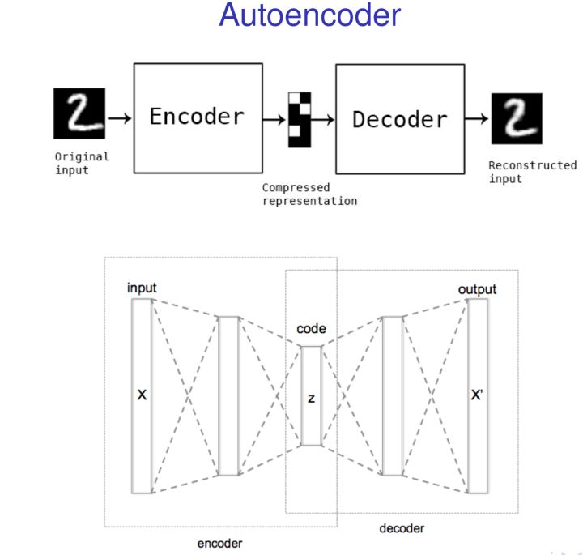

对于所有正常样本的训练集合，作者训练了一个autoencoder使得这个训练集的损失函数最小，其损失函数定义为：

$L(X_{train}) = \frac{1}{X_{train}} \sum_{x \in X_{train}} ||x - ae(x)||_2$

一旦训练得到一个autoencoder的模型，那么对于任意待测试的样本$x$，其重构误差为:

$E(x) = ||x - ae(x)||_p$

作者认为如果待测试的样本是正常样本，因为该样本与autoencoder的训练数据的生成过程相同，所以其重构误差很小，反之，如果带检测的样本是对抗样本，那么该样本的重构误差会很大。所以，在本文中作者用重构误差来衡量待检测样本与正常样本Manifold间的距离。但是，由于该距离是连续值，所以在本文中作者还利用验证集确定一个阈值 $r_{re}$，用来判断是否为对抗样本。

**2.基于概率分歧/发散（probability divergence）的Detector**

基于重构误差的Detector的适用于当样本的误差很大的时候，那么如果重构误差很小的时候呢？在本文中作者的解决方式是利用目标分类器来进一步检测。

大多数的神经网络分类器在最后一层实现softmax函数，即: $softmax(l)_i = \frac{exp(l_i)}{\sum_{j=1}^n exp(l_j)}$

本文定义 $f(x)$ 为神经网络softmax层对于输入 $x$ 的输出值， $ae(x)$ 为autoencoder $ae$ 接受输入 $x$ 时候产生的输出值，为输入 $x$ 先经过autoencoder然后再softmax函数后的输出值。在本文中作者认为，如果$x$是正常样本，$ae(x)$一般与$x$非常接近，那么$f(x)$与$f(ae(x))$的概率函数则非常接近；如果$x'$是对抗样本，$ae(x')$一般与$x'$差别非常大，尽管两者的重构误差可能很小，$f(x)$与$f(ae(x))$的概率函数的差别也会很大。

因此，作者利用 $f(x)$与$f(ae(x))$间的分歧来判断样本$x$是否为正常样本，分歧程度用Jensen-Shannon散度来衡量： $JSD(P||Q) = \frac{1}{2} D_{KL}(P||M) +\frac{1}{2} D_{KL}(Q||M)$其中  $D_{KL}(P||Q) = \sum_i P(i)log\frac{P(i)}{Q(i)}$，且 $M = \frac{1}{2}(P+Q)$

### Reformer

Reformer函数 $r: S \rightarrow N_t$用来重构测试输入样本，理想的reformer需要满足如下两个条件：

- 不应该改变正常样本的分类结构；
- 应该充分重构对抗样本，使得重构后的样本接近于正常样本。

基于上述思路，作者主要利用autoencoder来实现Reformer。通过在正常样本上训练得到一个autoencoder，然后利用该autoencoder，不论是对抗样本还是正常样本，都会输出一个于正常样本Manifold接近的样本，从而达到了理想reformer的要求。本文中作者展示了Reformer的效果如图3所示。

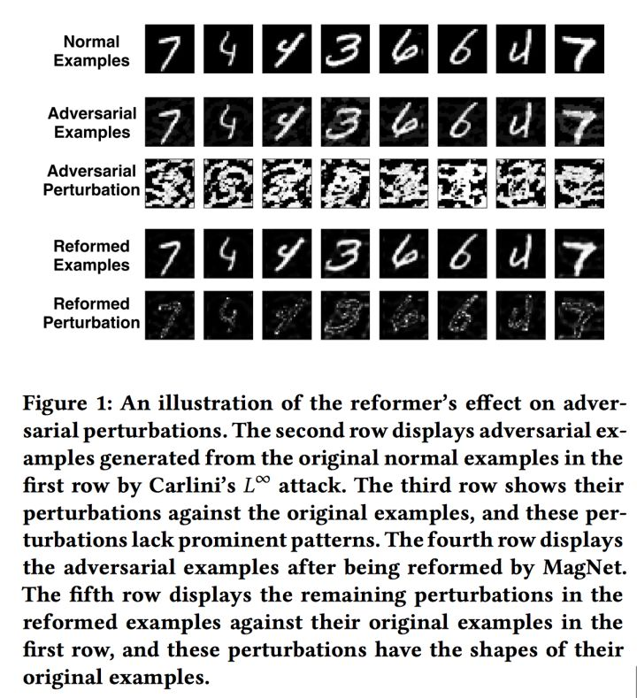

## MagNet的实验评估

文章中，作者主要基于MINST和CIFAR-10数据集，实验评估了MagNet防御方法针对常见的四种攻击(FGSM, Iterative, DeepFool和Carlini's)的防御效果。另外，针对这四种攻击模型，作者总结了三种攻击场景：

1. 黑盒攻击：攻击者不知道防御方法的任何参数、神经网络结构、训练集等；
2. 灰盒攻击：攻击了除了不知道防御方法的参数外，其他一切信息都了解；
3. 白盒攻击：攻击者了解防御方法的一切参数、神经网络结构、训练集等。

作者表明，针对白盒攻击，当前几乎没有任何防御方法，MagNet的防御效果也不理想。所以在本文中，作者主要展示了MagNet在黑盒攻击和灰盒攻击中的防御效果。


**MagNet对黑盒攻击的性能**

针对MINST和CIFAR-10数据集，文章显示了MagNet防御方法对黑盒攻击的防御效果，具体如下图4与图5所示。

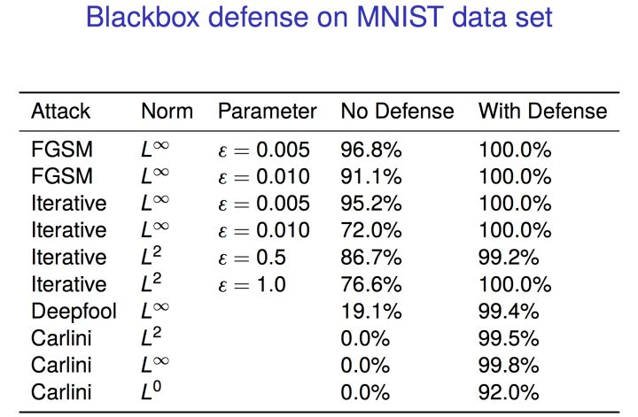

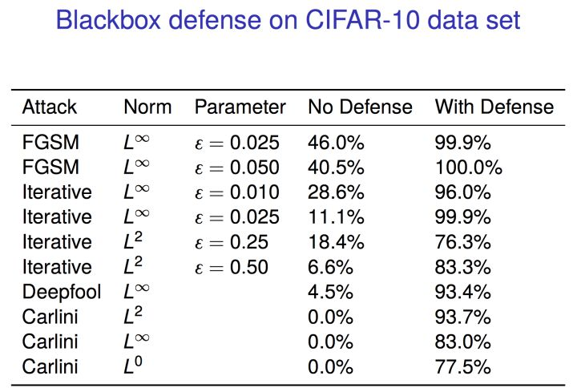

以最后一行为例，上述两图表明使用的Carlini攻击对两个数据集都能达到100%攻击成功效果（0%的分类成功），但是在MagNet的防御下，该分类准确度分别为92%和77.5%，表明攻击成功率只有8%和22.5%。所以，黑盒攻击下，MagNet的防御效果非常好！

**如何防御灰盒攻击？**

在灰盒攻击攻击下，攻击者不知道防御的具体参数，但是知道防御的具体结构、训练集合等，这样会极大地影响MagNet防御方法的效果。在本文中，作者认为即使我们不能完全消除对抗样本，我们也可能增加攻击者发现对抗样本的难度，从而增强训练器的鲁棒性。

本文利用了密码学中随机性的思想，在防御过程中创建了不同的autoencoder作为候选的Detector和Reformer。MagNet对每一个场景、每一个测试集、甚至每个测试样本都随机选择一个autoencoder。因此，可以通过增加autoencoder集合的大小和多样性，从而使得攻击更难，到达更好的防御效果。图6显示了针对CIFAR-10数据集Carlini攻击产生的对抗样本在MagNet防御下的分类正确性。

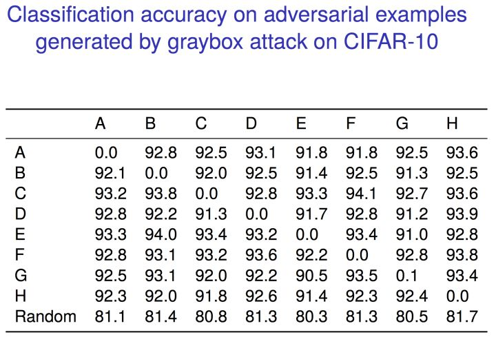

对角线上数据表明，当Carlini攻击中的autoencoder与MagNet在测试过程中使用的autoencoder相同时，MagNet的分类准确性大部分下降到0。但是当这两个autoencoder不同时，分类的准确度一般都在90%以上。最后一行表明，当攻击者在训练过程中随机选择一个autoencoder，并且MagNet在测试过程中也随机酸则一个autoencoder时候，MagNet的分类准确度保持在80%以上。

## 总结

本文提出一个针对神经网络中“对抗样本”的防御框架 — MagNet。MagNet框架中使用两种方法处理神经网络中的不可信的输入数据。该框架中首先使用Detector来检测所有样本中**扰动量大的对抗样本，**直接删除，然后针对**扰动量小的对抗样本**，努力找到一个接近正常样本的Manifold上的对应样本。这两种方法双管齐下共同提高神经网络的分类准确度。此外，通过使用autoencoder作为detector检测方法，MagNet在不需要任何对抗样本或者对抗样本产生过程知识的情况下达到检测对抗样本的目的，该检测方法具有更强的泛化能力。实验表明，MagNet可以有效地防御当前最新的对抗样本攻击手段。在攻击者知道MagNet训练样本的情况下，作者介绍了一个新的**灰盒攻击**模型，并利用随机化多样性来有效地抵御这种攻击。

另外，文章表明针对对抗样本的防御方法应该是attack-independent的。也就是说，我们不能从特定的生成过程找到对抗样本的属性，而应该是通过在所有对抗样本的生成过程中找到内在的共同特性来使得防御方法的泛化能力更强。作者同时表明，MagNet知识解决该问题第一步，并证明了其良好的性能。


# 对抗攻击论文总结


## 综述

机器学习的安全性《Can machine learning be secure?》

对机器学习安全性的影响可以通过两方面：一是在学习过程中调节训练数据《Poisoning attacks against support vector machines》，二是在预测过程中操控输入数据《In Machine Learning and Knowledge Discovery in Databases）。

------


## Attack

对抗问题最先由2013《Evasion attacks against machine learning at test time》提出，对抗攻击（Adversarial Attacks）的提出2014《Intriguing properties of neural networks》提出。

**对抗攻击产生的原因**，分为两个方面：深度神经网络模型的非线性加上不充分的模型平均和不充分的正则化导致的过拟合；《Explaining And Harnessing Adversarial Examples》提到高维空间中的线性性就足以造成对抗样本，深度模型对对抗样本的无力最主要的还是由于其线性部分的存在。

针对对抗攻击在**黑盒**攻击中的应用《Practical black-box attacks against deep learning systems using adversarial examples》，（增强学习中的黑盒攻击）《Adversarial Attacks on Neural Network Policies》，《Universal adversarial perturbations》中的构造样本方法也能在黑盒前提下发挥作用。 
通常的黑盒攻击都是在对抗攻击的transferability特性的情况下发挥作用，《Machine Learning as an Adversarial Service:Learning Black-Box Adversarial Examples》提出了直接采用对抗样本的方法进行黑盒攻击。

对抗攻击的**transferability特性**《Intriguing properties of neural networks》（多种神经网络结构），《Adversarial Attacks on Neural Network Policies》（在多种增强学习策略下），

**构建对抗样本**的算法（优化算法）： 
（**围绕两个问题**：difficult to find new methods that are both effective in jeopardizing a model and computationally affordable） 
1.传统的梯度下降，牛顿法，BFGS，L-BFGS 
2.Jacobian saliency map attack (JSMA) ：《The limitations of deep learning in adversarial settings 
2.5 FGSM：《Explaining And Harnessing Adversarial Examples》 
iterative version of FGSM：《Adversarial examples in the physical world》(smaller perturbation) 
3.RP2： 《Robust Physical-World Attacks on Machine Learning Models》 
4.Papernot Method：《 Adversarial perturbations against deep neural networks for malware classification》 
5.Universal Perturbations （extend of DeepFool method）：《Analysis of universal adversarial perturbations》《Universal adversarial perturbations》（**思考：能否根据universal原理将神经网络中的输入都加上同一个扰动，让对应的模型分类效果更好，从而得出置信度更高的分类结果**） 
6.DeepFool：《Deepfool: a simple and accurate method to fool deep neural networks. 》the first method to compute and apply the minimal perturbation necessary for misclassification under the L2 norm.（the approximation is more accurate than FGSM and faster than JSMA）（still computationally expensive） 
7.《Towards evaluating the robustness of neural networks》（The authors cast the formulation of Szegedy et al. into a more efficient optimization problem, which allows them to craft efficient adversarial samples with low distortion.）（also very expensive） 
\8. Virtual adversarial examples：《Virtual adversarial training: a regularization method for supervised and semi-supervised learning》

对抗攻击**应用在物理目标**上：（面部识别）《Accessorize to a crime: Real and stealthy attacks on state-of-the-art face recognition》，（拍照图片）《Adversarial examples in the physical world》，（路标）《Robust Physical-World Attacks on Machine Learning Models》 
，（自动汽车）《Concrete Problems for Autonomous Vehicle Safety:Advantages of Bayesian Deep Learning》，（恶意软件分类）《Adversarial Perturbations Against Deep Neural Networks for Malware Classification》

在**增强学习**上的应用《Vulnerability of deep reinforcement learning to policy induction attacks.》，《Adversarial Attacks on Neural Network Policies》

**增强攻击效果**的方法： 
《Adversarial Attacks on Image Recognition》提到可以通过PCA降维处理数据

------


## Defence

defence的两个方向： 《Adversarial Attacks on Neural Network Policies》（作为future work提到） 
\1. 将对抗样本加入到训练集中。即是可以手动生成对抗样本，并加入到训练集中。（但是生成对抗样本的代价比较大） 
\2. 在测试模型时增加一个探测对抗输入的模块，判断输入是否有对抗攻击 
**Defence**的方法：

1. Adversarial Training（augmenting the training data with perturbed examples）：《Intriguing properties of neural networks》（either feeding a model with both true and adversarial examples or learning it using the following modified objective function: 
   J ˆ(θ, x, y) = αJ(θ, x, y) + (1 − α)J(θ, x + ∆x, y)）
2. Defensive distillation：《Distillation as a defense to adversarial perturbations against deep neural networks》--hardens the model in two steps: first, a classification model is trained and its softmax layer is smoothed by division with a constant T ; then, a second model is trained using the same inputs, but instead of feeding it the original labels, the probability vectors from the last layer of the first model are used as soft targets. （《Adversarial perturbations of deep neural networks》对这种方法进行了改动，只需要一步即可构成攻击）
3. Feature squeezing：《Feature squeezing: Detecting adversarial examples in deep neural networks》《Feature squeezing mitigates and detects carlini/wagner adversarial examples》
4. Detection systems: 
   performe statistical tests:《On the (statistical) detection of adversarial examples》 
   use an additional model for detection:《Adversarial and clean data are not twins》《On detecting adversarial perturbations》 
   apply dropout at test time:《Detecting adversarial samples from artifacts》
5. PCA whitening ：《Early methods for detecting adversarial images》


## 研究点：

1. 各种攻击方式的优化
2. defence策略的构建
3. 针对各种特定应用场景的对抗
4. 利用攻击和defence策略优化现有模型结构，增强机器学习模型的效果
5. 探究对抗攻击深层原理，理解其背后的数学本质，实际上就是理解深度神经网络的工作原理以及对抗攻击为什么能有作用。 
   **思考：对抗攻击的问题，好像神经网络泛化性能的限制问题，因为增加的很小的扰动就能让模型错误率比较高，说明模型的泛化能力不够强，针对其他样本的效果也不是很好，因此，增强神经网络模型的泛化能力也是defence策略的一个方向，尤其是在黑盒攻击方面**


## 意义  (citing from )

1. Able to handle massive volumes of data
2. Works at machine speed to thwart attacks
3. Does not rely on signatures
4. Can stop known and unknown malware
5. Stops malware pre-execution
6. Higher detection retes, lower false positives


